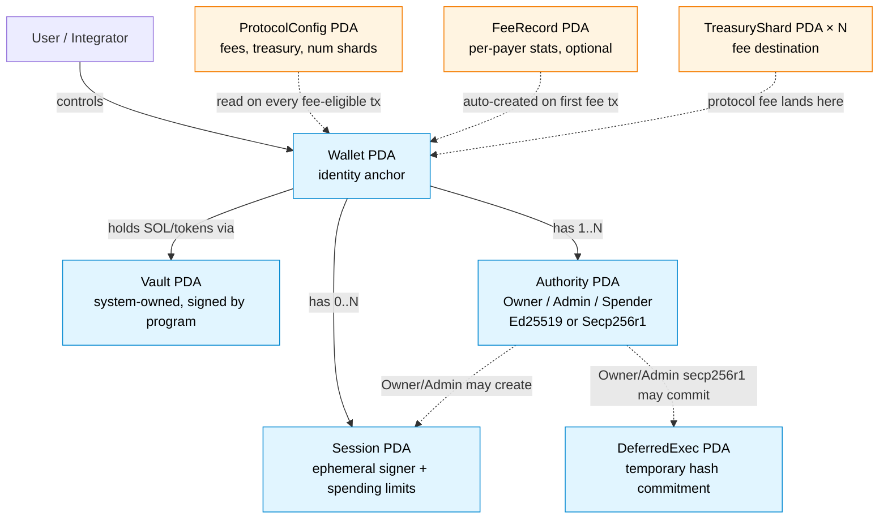
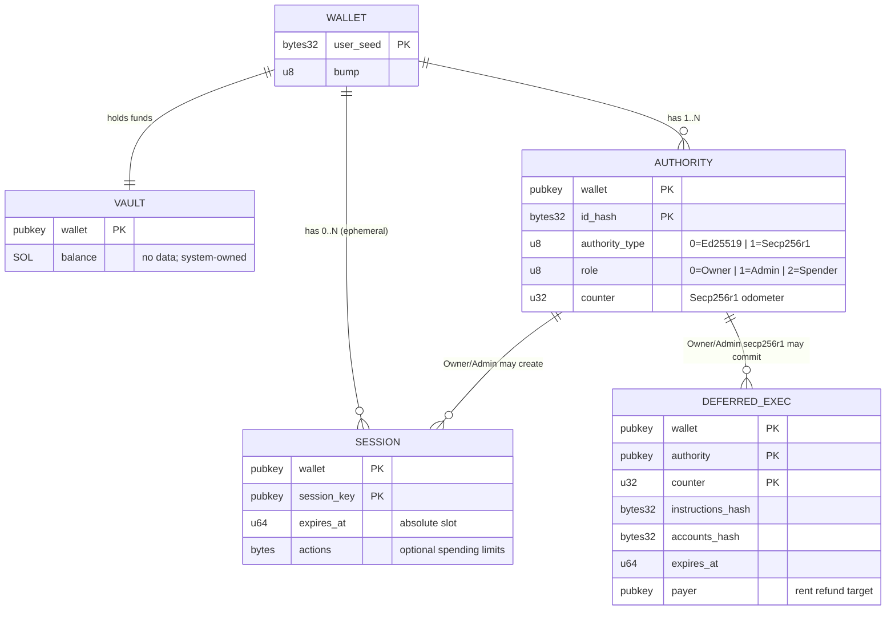
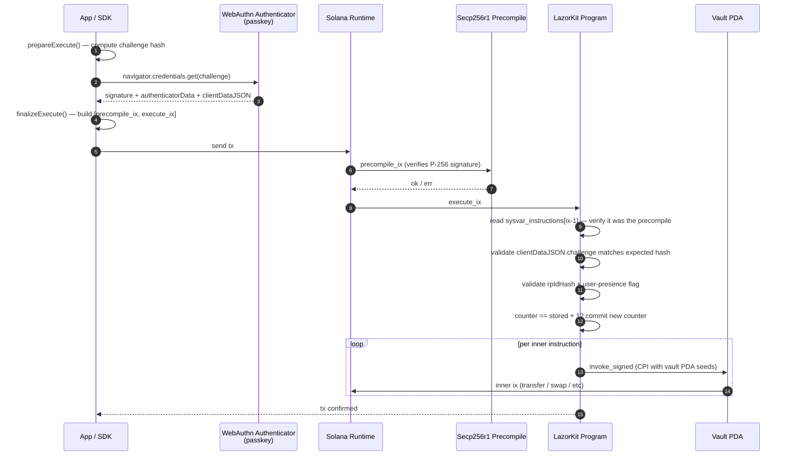
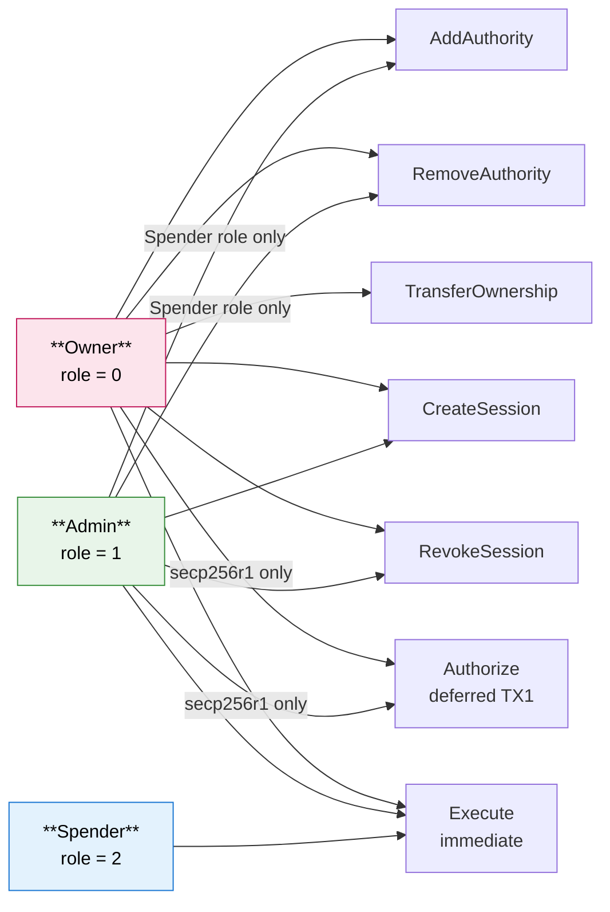
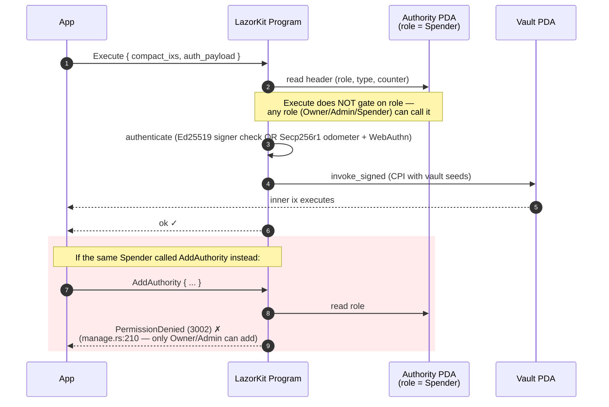
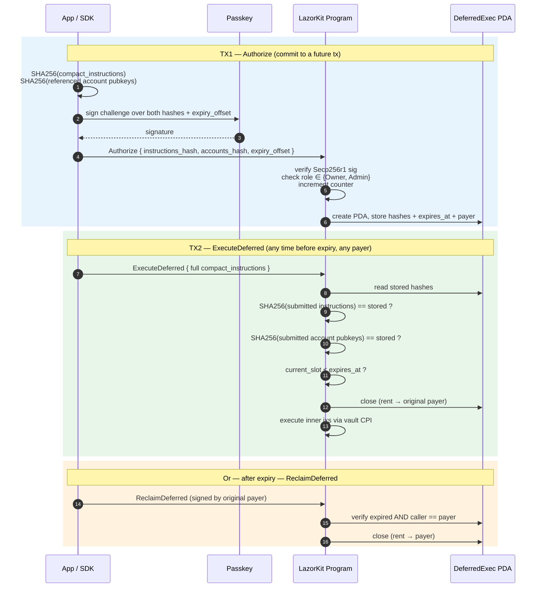

# Architecture

Technical reference for the LazorKit on-chain program. If you just want to use the SDK, see [`sdk/sdk-legacy/README.md`](../sdk/sdk-legacy/README.md).

## Design principles

- **Zero-copy state** — pinocchio casts raw bytes to Rust structs; no Borsh.
- **NoPadding structs** — custom derive ensures memory safety and tight packing.
- **Per-authority storage** — each authority gets its own PDA (no per-wallet list, no resize).
- **Strict RBAC** — Owner (0) / Admin (1) / Spender (2).
- **Compact instructions** — index-based references for inner CPI accounts.

## Account model at a glance

A LazorKit wallet is a constellation of PDAs. The user-facing identity is the
**Wallet** PDA; assets live in a separate **Vault** PDA; signing power is held
by one or more **Authority** PDAs (each with its own role and auth type);
optional **Session** PDAs delegate scoped signing to ephemeral keys; and
**DeferredExec** PDAs are temporary commitments used for the 2-tx large-payload
flow.



The same picture as a relational schema (one row per record type, edges show
"has many" / "has one"):



Three things worth committing to memory before reading further:

1. The **Vault** is what spends. The **Authority** is what proves you can sign.
   They're separate PDAs.
2. An **Authority** is a key + a role + a wallet. The same key can be an
   Authority on multiple wallets and have a different role on each.
3. **Sessions** and **DeferredExec** are scoped extensions of an Authority's
   power, not separate identities. They're closed when no longer needed.

## Security mechanisms

### Replay protection

- **Secp256r1 odometer counter (primary)** — program-controlled u32 per authority. Client submits `stored + 1`. The WebAuthn hardware counter is intentionally ignored because synced passkeys (iCloud, Google) return unreliable values. Counter is committed only after successful signature verification.
- **Clock-based slot freshness (secondary)** — slot from `auth_payload` must be within 150 slots of `Clock::get()`. No SlotHashes sysvar needed.
- **Anti-CPI check** — `get_stack_height() > 1` rejects authentication via CPI.
- **Signature binding** — challenge hash includes discriminator, payer, counter, and program_id. The accounts_hash binds the set of inner accounts, preventing recipient-reordering attacks.
- **Ed25519** — standard Solana runtime signer check. No counter (Ed25519 signatures can't replay because they sign over the tx recent blockhash).
- **Sessions** — absolute slot-based expiry, max ~30 days.

### Challenge hash (Secp256r1)

```
SHA256(
  discriminator
  || auth_payload_prefix[14]
  || signed_payload
  || payer
  || counter_le(4)
  || program_id
)
```

6 elements, one `sol_sha256` syscall. Only the 14-byte prefix of `auth_payload` (`[slot(8)][counter(4)][sysvarIxIdx(1)][reserved(1)]`) is hashed — the rest contains `clientDataJSON`, which is produced by the authenticator **after** signing the challenge, so it can't be in the hash input.

### WebAuthn flow

LazorKit supports only the raw-clientDataJSON flow (what every real browser authenticator produces). The on-chain program:

1. Receives the full `clientDataJSON` bytes from the authenticator.
2. Validates the `type` field is `"webauthn.get"` and the `challenge` field matches `base64url(expected_challenge_hash)`.
3. Hashes the raw bytes to build the precompile signed message.
4. Verifies `rpIdHash` in authenticator data against the on-chain stored `rpIdHash` (constant-time).
5. Checks User Presence (`flags & 0x01`). The WebAuthn hardware counter is not checked.

Programmatic/bot signing should use Ed25519 authorities, not Secp256r1.

### Secp256r1 Execute sequence

End-to-end signing flow for an Execute call signed by a passkey. The SDK and
the on-chain program split signing into a *prepare* phase (compute the
challenge) and a *finalize* phase (assemble the precompile + Execute
instructions after the authenticator signs).



Two non-obvious points:
- The precompile runs **before** the Execute instruction in the same tx, and
  Execute introspects `sysvar_instructions` to confirm it. Skipping the
  precompile or reordering it triggers `InvalidInstruction`.
- The **odometer counter** (not the WebAuthn hardware counter) is what
  prevents replay. It's bumped only after every other check passes.

## Account layouts

### Discriminators

```rust
pub enum AccountDiscriminator {
    Wallet        = 1,
    Authority     = 2,
    Session       = 3,
    DeferredExec  = 4,
    ProtocolConfig = 5,
    FeeRecord     = 6,
    TreasuryShard = 7,
}
```

### Wallet PDA — 8 bytes

Seeds: `["wallet", user_seed]`

```rust
#[repr(C, align(8))]
pub struct WalletAccount {
    pub discriminator: u8,   // 1
    pub bump: u8,
    pub version: u8,
    pub _padding: [u8; 5],
}
```

### Authority PDA

Seeds: `["authority", wallet_pubkey, id_hash]`

48-byte fixed header + auth-type-specific data:

```rust
#[repr(C, align(8))]
pub struct AuthorityAccountHeader {
    pub discriminator: u8,   // 2
    pub authority_type: u8,  // 0=Ed25519, 1=Secp256r1
    pub role: u8,            // 0=Owner, 1=Admin, 2=Spender
    pub bump: u8,
    pub version: u8,
    pub _padding1: [u8; 3],
    pub counter: u32,        // Secp256r1 odometer
    pub _padding2: [u8; 4],
    pub wallet: Pubkey,
}
```

Variable data after header:

- **Ed25519**: `[pubkey(32)]` — total 80 bytes.
- **Secp256r1**: `[credential_id_hash(32)][compressed_pubkey(33)][rpIdHash(32)]` — total 145 bytes fixed.

`rpIdHash` is pre-computed at authority creation (SHA-256 of the rpId string) and stored directly, eliminating one `sol_sha256` syscall per Execute.

### Session PDA — 80+ bytes

Seeds: `["session", wallet_pubkey, session_key]`

```rust
#[repr(C, align(8))]
pub struct SessionAccount {
    pub discriminator: u8,   // 3
    pub bump: u8,
    pub version: u8,
    pub _padding: [u8; 5],
    pub wallet: Pubkey,
    pub session_key: Pubkey,
    pub expires_at: u64,     // Absolute slot
}
```

Optional **actions** buffer appended after the header (variable length, max 2048 bytes). Each action: 11-byte header `[type(1)][data_len(2 LE)][expires_at(8 LE)]` + type-specific data. Max 16 actions per session.

| Type | ID | Data | Description |
|---|---|---|---|
| SolLimit | 1 | remaining(8) | Lifetime SOL cap |
| SolRecurringLimit | 2 | limit∥spent∥window∥last_reset(32) | Per-window SOL cap |
| SolMaxPerTx | 3 | max(8) | Max SOL gross outflow per execute |
| TokenLimit | 4 | mint(32)∥remaining(8) | Lifetime token cap per mint |
| TokenRecurringLimit | 5 | mint∥limit∥spent∥window∥last_reset(64) | Per-window token cap |
| TokenMaxPerTx | 6 | mint(32)∥max(8) | Max tokens per execute per mint |
| ProgramWhitelist | 10 | program_id(32) | Allow-list a CPI target (repeatable) |
| ProgramBlacklist | 11 | program_id(32) | Block-list a CPI target (repeatable) |

**Expired-action policy**: expired spending limits are treated as **fully exhausted** (any spend denied); expired whitelists are **hard deny**; expired blacklist entries are silently dropped.

**Vault invariants (H1 fix)**: during a session+actions Execute, the program snapshots `vault.owner()`, `vault.data.len()`, and per-listed-mint token account `owner` / `delegate` / `close_authority` before the CPI loop, and rejects if any changed. This prevents escape via `System::Assign`, SPL Token `SetAuthority`, or `Approve`.

### DeferredExec PDA — 176 bytes

Seeds: `["deferred", wallet_pubkey, authority_pubkey, counter_le(4)]`

```rust
#[repr(C, align(8))]
pub struct DeferredExecAccount {
    pub discriminator: u8,           // 4
    pub version: u8,
    pub bump: u8,
    pub _padding: [u8; 5],
    pub instructions_hash: [u8; 32], // SHA256 of compact instructions
    pub accounts_hash: [u8; 32],     // SHA256 of referenced account pubkeys
    pub wallet: Pubkey,
    pub authority: Pubkey,
    pub payer: Pubkey,               // Receives rent refund on close
    pub expires_at: u64,
}
```

Temporary account created during `Authorize` (tx1), closed during `ExecuteDeferred` (tx2). The authority's odometer counter is used as a seed nonce, so each authorization gets a unique PDA. Expired authorizations can be reclaimed via `ReclaimDeferred`.

### Vault PDA

Seeds: `["vault", wallet_pubkey]`

No data allocated. Holds SOL as a System-owned account (`data_len = 0`, `owner = SystemProgram`). Program signs for it via PDA seeds during Execute/ExecuteDeferred.

### Protocol fee accounts

LazorKit's entrypoint can collect fees before dispatching to `CreateWallet` / `Execute` / `ExecuteDeferred` processors.

```rust
// ProtocolConfig PDA ["protocol_config"] — 88 bytes, disc 5
pub struct ProtocolConfig {
    pub discriminator: u8, pub version: u8, pub bump: u8,
    pub enabled: u8, pub num_shards: u8, pub _padding: [u8; 3],
    pub admin: Pubkey, pub treasury: Pubkey,
    pub creation_fee: u64, pub execution_fee: u64,
}

// FeeRecord PDA ["fee_record", payer_pubkey] — 32 bytes, disc 6
// Per-payer reward-tracking counters.

// TreasuryShard PDA ["treasury_shard", shard_id_u8] — 8 bytes, disc 7
// Sharded fee destination (N shards spread write contention).
```

Fee flow: SDK appends `[protocolConfig, feeRecord, treasuryShard, systemProgram]` to fee-eligible instructions. Entrypoint transfers `fee` from payer to a random `treasuryShard`, bumps `FeeRecord` counters if one exists (otherwise just charges the fee), then strips the 4 accounts and dispatches to the processor. Admin withdraws from shards to `treasury` via `WithdrawTreasury`.

## Auth payload layout (Secp256r1)

```
[slot(8)]                   // 8 bytes — Clock-based slot freshness
[counter(4)]                // 4 bytes — odometer value (stored + 1)
[sysvar_ix_index(1)]        // 1 byte  — index of sysvar_instructions in accounts
[reserved(1)]               // 1 byte  — set to 0x80 (legacy mode marker)
[auth_data_len(2 LE)]       // 2 bytes
[authenticator_data(M)]     // M bytes — WebAuthn authenticator data (≥ 37)
[cdj_len(2 LE)]             // 2 bytes
[client_data_json(N)]       // N bytes — raw clientDataJSON from authenticator
```

The first 14 bytes form the deterministic prefix that's hashed into the challenge. Everything after is bound into the signature via the precompile's signed message (`authenticatorData ∥ SHA256(clientDataJSON)`).

## Roles and permissions (RBAC)

Every Authority has a numeric `role` field. The role determines which program
instructions that authority is allowed to invoke. The matrix below is
enforced by the program — an Authority that calls something it isn't
allowed to fails with `PermissionDenied (3002)`.



**Reading the diagram:** an arrow from a role to an instruction means
"authorities with this role can call this instruction." Edge labels record
extra constraints (e.g. Admin can only add `Spender`-role authorities;
`Authorize` requires the auth type to be Secp256r1).

Notable rules not visible above:

- The **Owner role itself can never be removed** (`manage.rs:430`). Only
  `TransferOwnership` swaps it atomically with a new Owner.
- An authority **cannot remove itself** (`manage.rs:435`).
- `ExecuteDeferred` (TX2) and `ReclaimDeferred` are not gated by role —
  they're gated by hash match + payer-pubkey, respectively. Anyone can
  submit TX2; only the original payer can reclaim after expiry.

### Concrete RBAC enforcement: a Spender calling Execute

The role check is per-instruction, not per-authority globally. Below is what
happens when a Spender (lowest privilege) calls `Execute` — and what would
happen if the same Spender tried to call `AddAuthority` instead.



This is why "**Execute is the universal action**" is a useful mental model:
every role can execute, but everything *else* requires Admin or Owner.

## Instruction reference

Wallet operations:

| Disc | Instruction | Description |
|---|---|---|
| 0 | CreateWallet | Create wallet + vault + first authority |
| 1 | AddAuthority | Add Ed25519/Secp256r1 authority |
| 2 | RemoveAuthority | Remove authority; refund rent |
| 3 | TransferOwnership | Atomic owner swap |
| 4 | Execute | Execute compact instructions via CPI with vault signing |
| 5 | CreateSession | Create session key (optional actions) |
| 6 | Authorize | Deferred TX1 — store instruction/account hashes |
| 7 | ExecuteDeferred | Deferred TX2 — execute and close |
| 8 | ReclaimDeferred | Close an expired DeferredExec, refund rent |
| 9 | RevokeSession | Close a session early, refund rent |

Protocol admin instructions (admin-only):

| Disc | Instruction |
|---|---|
| 10 | InitializeProtocol |
| 11 | UpdateProtocol |
| 12 | RegisterPayer |
| 13 | WithdrawTreasury |
| 14 | InitializeTreasuryShard |

All admin instructions verify both `admin.is_signer()` **and** `config_pda.owner() == program_id` (H2 fix).

## Compact instruction format

Binary format packed into the Execute instruction data:

```
[num_instructions(1)]       // Max 16
For each:
  [program_id_index(1)]     // Index into tx accounts
  [num_accounts(1)]
  [account_indexes(N)]      // 1 byte each
  [data_len(2 LE)]
  [instruction_data(M)]
```

Indexes replace 32-byte pubkeys with 1-byte references, shrinking Secp256r1 Execute tx size from ~1.2KB (uncompressed) to ~800 bytes.

**Accounts hash** — for Secp256r1 Execute the signed payload includes `SHA256(concat of all pubkeys referenced by compact indexes)`. Prevents account-reordering attacks (e.g., swapping recipient addresses).

## Parallel execution

Different authorities on the same wallet can execute **in parallel** on Solana's scheduler:

| Account | Access | Shared? |
|---|---|---|
| Authority PDA | writable (counter++) | No — per-authority |
| Wallet PDA | read-only | Yes, but no write lock |
| Vault PDA | signer-only (CPI) | Yes, but no write lock |

Two different authorities on the same wallet have different writable PDAs → Solana's scheduler runs them concurrently. Same authority in two txs → counter conflict → serialized.

This means admins, spenders, and session keys can all operate on the same wallet without blocking each other.

## Deferred execution

2-transaction flow for payloads exceeding the ~574 bytes available in a single Secp256r1 Execute (e.g., Jupiter swaps with complex routing).

1. **TX1 (Authorize)** — signer computes `instructions_hash = SHA256(compact_instructions)` and `accounts_hash = SHA256(referenced_pubkeys)`. These are signed via Secp256r1 and stored in a `DeferredExec` PDA. Odometer counter is incremented.
2. **TX2 (ExecuteDeferred)** — any payer submits the full compact instructions. Program verifies both hashes, closes the `DeferredExec` account (close-before-CPI pattern), and executes via CPI with vault signing.



Properties:
- Odometer counter provides a unique PDA seed per authorization.
- Expiry window: 10–9,000 slots (~4 s to ~1 h).
- Only Secp256r1 Owner/Admin can authorize (not Ed25519, not Spender).
- If TX2 never runs, the original payer can reclaim rent after expiry via `ReclaimDeferred`.

## Compute cost

See `docs/` for benchmarks. Top-line numbers on hot paths:

| Path | CU | Notes |
|---|---|---|
| Normal SOL Transfer (baseline) | 150 | Solana runtime minimum |
| Execute (Session key) | ~4,100 | No precompile, no auth payload |
| Execute (Secp256r1 passkey) | ~9,440 | Includes ~2,300 CU Secp256r1 precompile |
| Execute (Ed25519 authority) | ~5,900 | No precompile |
| CreateWallet (Ed25519 or Secp256r1) | ~15-20K | One-time |

All paths fit comfortably within Solana's 200K CU default budget.

The precompile alone is a 2,300 CU floor on Secp256r1 Execute; the remaining ~7,100 CU covers account validation, odometer counter, challenge hashing, clientDataJSON validation, accounts_hash computation, inner CPI, and state bookkeeping.
