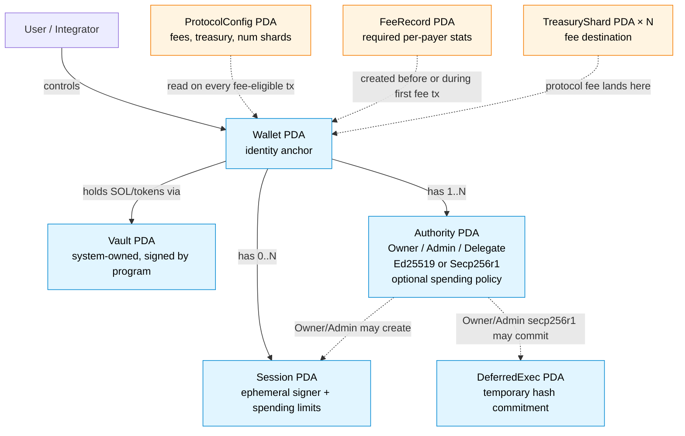
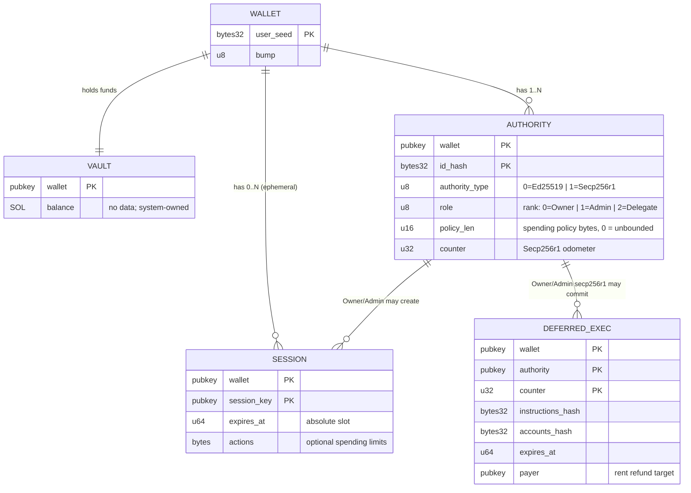
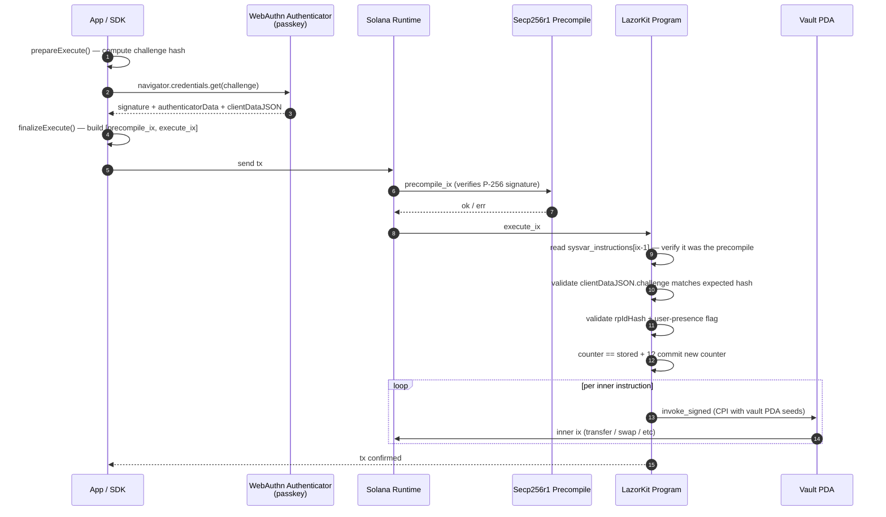
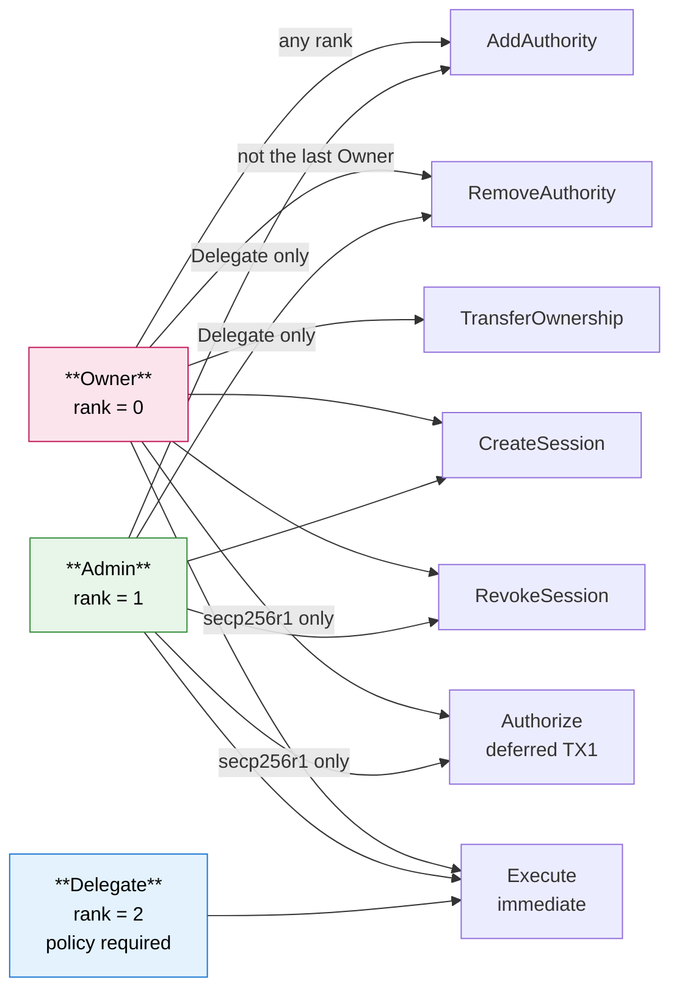
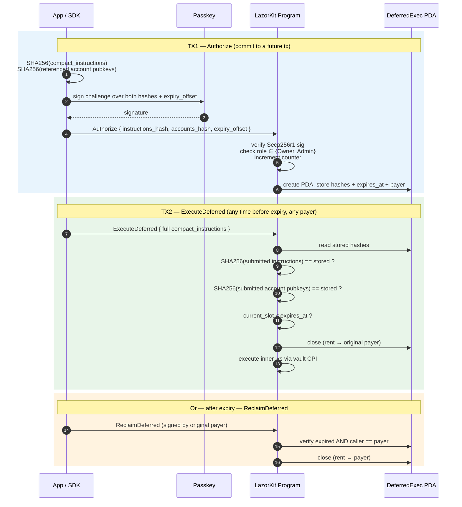

# Architecture

Technical reference for the LazorKit on-chain program. If you just want to use the SDK, see [`sdk/sdk-legacy/README.md`](../sdk/sdk-legacy/README.md).

## Design principles

- **Zero-copy state** — pinocchio casts raw bytes to Rust structs; no Borsh.
- **NoPadding structs** — custom derive ensures memory safety and tight packing.
- **Per-authority storage** — each authority gets its own PDA (no per-wallet list, no resize).
- **Rank and policy are separate** — rank (Owner / Admin / Delegate) says what an
  authority may manage; its policy says what it may spend.
- **Compact instructions** — index-based references for inner CPI accounts.

## Account model at a glance

A LazorKit wallet is a constellation of PDAs. The user-facing identity is the
**Wallet** PDA; assets live in a separate **Vault** PDA; signing power is held
by one or more **Authority** PDAs (each with its own role and auth type);
optional **Session** PDAs delegate scoped signing to ephemeral keys; and
**DeferredExec** PDAs are temporary commitments used for the 2-tx large-payload
flow.


```mermaid
graph TD
    User[User / Integrator] -->|controls| Wallet[Wallet PDA<br/>identity anchor]
    Wallet -->|holds SOL/tokens via| Vault[Vault PDA<br/>system-owned, signed by program]
    Wallet -->|has 1..N| Auth[Authority PDA<br/>Owner / Admin / Delegate<br/>Ed25519 or Secp256r1<br/>optional spending policy]
    Wallet -->|has 0..N| Session[Session PDA<br/>ephemeral signer + spending limits]
    Auth -.->|Owner/Admin may create| Session
    Auth -.->|Owner/Admin secp256r1 may commit| Deferred[DeferredExec PDA<br/>temporary hash commitment]

    Config[ProtocolConfig PDA<br/>fees, treasury, num shards] -.->|read on every fee-eligible tx| Wallet
    FeeRecord[FeeRecord PDA<br/>required per-payer stats] -.->|created before or during first fee tx| Wallet
    Treasury[TreasuryShard PDA × N<br/>fee destination] -.->|protocol fee lands here| Wallet

    classDef pda fill:#e1f5ff,stroke:#0288d1,color:#000
    classDef proto fill:#fff4e1,stroke:#f57c00,color:#000
    class Wallet,Vault,Auth,Session,Deferred pda
    class Config,FeeRecord,Treasury proto
```

The same picture as a relational schema (one row per record type, edges show
"has many" / "has one"):


```mermaid
erDiagram
    WALLET ||--|| VAULT : "holds funds"
    WALLET ||--o{ AUTHORITY : "has 1..N"
    WALLET ||--o{ SESSION : "has 0..N (ephemeral)"
    AUTHORITY ||--o{ SESSION : "Owner/Admin may create"
    AUTHORITY ||--o{ DEFERRED_EXEC : "Owner/Admin secp256r1 may commit"

    WALLET {
        bytes32 user_seed PK
        u8 bump
    }
    VAULT {
        pubkey wallet PK
        SOL balance "no data; system-owned"
    }
    AUTHORITY {
        pubkey wallet PK
        bytes32 id_hash PK
        u8 authority_type "0=Ed25519 | 1=Secp256r1"
        u8 role "rank: 0=Owner | 1=Admin | 2=Delegate"
        u16 policy_len "spending policy bytes, 0 = unbounded"
        u32 counter "Secp256r1 odometer"
    }
    SESSION {
        pubkey wallet PK
        pubkey session_key PK
        u64 expires_at "absolute slot"
        bytes actions "optional spending limits"
    }
    DEFERRED_EXEC {
        pubkey wallet PK
        pubkey authority PK
        u32 counter PK
        bytes32 instructions_hash
        bytes32 accounts_hash
        u64 expires_at
        pubkey payer "rent refund target"
    }
```

Three things worth committing to memory before reading further:

1. The **Vault** is what spends. The **Authority** is what proves you can sign.
   They're separate PDAs.
2. An **Authority** is a key + a role + a wallet. The same key can be an
   Authority on multiple wallets and have a different role on each.
3. **Sessions** and **DeferredExec** are scoped extensions of an Authority's
   power, not separate identities. They're closed when no longer needed.

## Security mechanisms

### Replay protection

- **Secp256r1 odometer counter (primary)** — program-controlled u32 per authority. Client submits `stored + 1`. The WebAuthn hardware counter is intentionally ignored because synced passkeys (iCloud, Google) return unreliable values. Counter is committed only after successful signature verification, and checked arithmetic rejects the terminal `u32::MAX -> 0` wrap case with `ArithmeticOverflow`.
- **Clock-based slot freshness (secondary)** — slot from `auth_payload` must be within 150 slots of `Clock::get()`. No SlotHashes sysvar needed.
- **Anti-CPI check** — `get_stack_height() > 1` rejects authentication via CPI.
- **Signature binding** — challenge hash includes discriminator, payer, counter, and program_id. The accounts_hash binds the set of inner accounts, preventing recipient-reordering attacks.
- **Ed25519** — standard Solana runtime signer check. No counter (Ed25519 signatures can't replay because they sign over the tx recent blockhash).
- **Sessions** — absolute slot-based expiry, max ~30 days.

### Challenge hash (Secp256r1)

```
SHA256(
  discriminator
  || auth_payload_prefix[14]
  || signed_payload
  || payer
  || counter_le(4)
  || program_id
)
```

6 elements, one `sol_sha256` syscall. Only the 14-byte prefix of `auth_payload` (`[slot(8)][counter(4)][sysvarIxIdx(1)][reserved(1)]`) is hashed — the rest contains `clientDataJSON`, which is produced by the authenticator **after** signing the challenge, so it can't be in the hash input.

### WebAuthn flow

LazorKit supports only the raw-clientDataJSON flow (what every real browser authenticator produces). The on-chain program:

1. Receives the full `clientDataJSON` bytes from the authenticator.
2. Validates the `type` field is `"webauthn.get"` and the `challenge` field matches `base64url(expected_challenge_hash)`.
3. Hashes the raw bytes to build the precompile signed message.
4. Verifies `rpIdHash` in authenticator data against the on-chain stored `rpIdHash` (constant-time).
5. Checks User Presence (`flags & 0x01`). The WebAuthn hardware counter is not checked.

Programmatic/bot signing should use Ed25519 authorities, not Secp256r1.

### Secp256r1 Execute sequence

End-to-end signing flow for an Execute call signed by a passkey. The SDK and
the on-chain program split signing into a *prepare* phase (compute the
challenge) and a *finalize* phase (assemble the precompile + Execute
instructions after the authenticator signs).


```mermaid
sequenceDiagram
    autonumber
    participant App as App / SDK
    participant WA as WebAuthn Authenticator<br/>(passkey)
    participant SOL as Solana Runtime
    participant PRE as Secp256r1 Precompile
    participant LK as LazorKit Program
    participant V as Vault PDA

    App->>App: prepareExecute() — compute challenge hash
    App->>WA: navigator.credentials.get(challenge)
    WA-->>App: signature + authenticatorData + clientDataJSON
    App->>App: finalizeExecute() — build [precompile_ix, execute_ix]
    App->>SOL: send tx
    SOL->>PRE: precompile_ix (verifies P-256 signature)
    PRE-->>SOL: ok / err
    SOL->>LK: execute_ix
    LK->>LK: read sysvar_instructions[ix-1] — verify it was the precompile
    LK->>LK: validate clientDataJSON.challenge matches expected hash
    LK->>LK: validate rpIdHash + user-presence flag
    LK->>LK: counter == stored + 1? commit new counter
    loop per inner instruction
        LK->>V: invoke_signed (CPI with vault PDA seeds)
        V->>SOL: inner ix (transfer / swap / etc)
    end
    LK-->>App: tx confirmed
```

Two non-obvious points:
- The precompile runs **before** the Execute instruction in the same tx, and
  Execute introspects `sysvar_instructions` to confirm it. Skipping the
  precompile or reordering it triggers `InvalidInstruction`.
- The **odometer counter** (not the WebAuthn hardware counter) is what
  prevents replay. It's bumped only after every other check passes.

## Account layouts

### Discriminators

The high nibble is the protocol major version, so a v1 account fails the
discriminator check immediately rather than being reinterpreted under a layout
that has moved underneath it.

```rust
pub const PROTOCOL_VERSION: u8 = 2;

pub enum AccountDiscriminator {
    Wallet         = 0x21,
    Authority      = 0x22,
    Session        = 0x23,
    DeferredExec   = 0x24,
    ProtocolConfig = 0x25,
    FeeRecord      = 0x26,
    TreasuryShard  = 0x27,
}
```

Every PDA seed carries the same version as a literal prefix — `lk2:wallet`,
`lk2:authority`, and so on. The two mechanisms do different jobs and both are
needed: the seed prefix makes the v2 address space disjoint from v1's, and the
discriminator makes a v1 account that somehow arrives fail loudly. See
[upgrade-procedure.md](upgrade-procedure.md).

### Wallet PDA — 8 bytes

Seeds: `["lk2:wallet", user_seed]`

```rust
#[repr(C, align(8))]
pub struct WalletAccount {
    pub discriminator: u8,   // 0x21
    pub bump: u8,
    pub version: u8,
    pub _padding: [u8; 1],
    pub owner_count: u32,    // authorities on this wallet holding rank Owner
}
```

`owner_count` is what refuses the removal of the last Owner. A wallet with no
Owner is not frozen — its Admins and Delegates keep spending — but nothing can
ever be added or revoked again, so a lost device would stay valid forever.

### Authority PDA

Seeds: `["lk2:authority", wallet_pubkey, id_hash]`

48-byte fixed header + auth-type-specific data + an optional policy:

```rust
#[repr(C, align(8))]
pub struct AuthorityAccountHeader {
    pub discriminator: u8,   // 0x22
    pub authority_type: u8,  // 0=Ed25519, 1=Secp256r1
    pub role: u8,            // rank: 0=Owner, 1=Admin, 2=Delegate
    pub bump: u8,
    pub version: u8,
    pub _padding1: [u8; 3],
    pub counter: u32,        // Secp256r1 odometer
    pub policy_len: u16,     // action buffer length, 0 = unbounded
    pub _padding2: [u8; 2],
    pub wallet: Pubkey,
}
```

Variable data after header:

- **Ed25519**: `[pubkey(32)]` — 80 bytes, plus `policy_len` bytes of policy.
- **Secp256r1**: `[credential_id_hash(32)][compressed_pubkey(33)][rpIdHash(32)]` —
  145 bytes, plus `policy_len` bytes of policy.

`role` is a **rank**: what this authority may *manage*. The policy is what it may
*spend*. They are independent, and conflating them is what made "Spender" a name
for a tier that had full control of the vault — rank was checked at five
management sites and nowhere in `Execute`. A Delegate is required to carry a
policy for exactly that reason; Owner and Admin may carry one optionally.

An authority whose own `policy_len` is non-zero may not add authorities at all.
Comparing two policies to prove a grant is no wider than the granter's is a hard
problem; refusing the grant sidesteps it.

`CreateWallet` and `AddAuthority` reject all-zero Ed25519 pubkeys, all-zero
Secp256r1 credential hashes, and all-zero Secp256r1 compressed pubkeys before
deriving or initializing the Authority PDA. SDK owner/authority helpers apply
the same non-zero identity checks before building create, add, and ownership
transfer instructions; on-chain `TransferOwnership` also rejects an all-zero
authority seed.

`rpIdHash` is pre-computed at authority creation (SHA-256 of the rpId string) and stored directly, eliminating one `sol_sha256` syscall per Execute.

### Session PDA — 80+ bytes

Seeds: `["lk2:session", wallet_pubkey, session_key]`

```rust
#[repr(C, align(8))]
pub struct SessionAccount {
    pub discriminator: u8,   // 0x23
    pub bump: u8,
    pub version: u8,
    pub _padding: [u8; 5],
    pub wallet: Pubkey,
    pub session_key: Pubkey,
    pub expires_at: u64,     // Absolute slot
}
```

Optional **actions** buffer appended after the header (variable length, max 2048 bytes). Each action: 11-byte header `[type(1)][data_len(2 LE)][expires_at(8 LE)]` + type-specific data. Max 16 actions per session.

| Type | ID | Data | Description |
|---|---|---|---|
| SolLimit | 1 | remaining(8) | Lifetime SOL cap |
| SolRecurringLimit | 2 | limit∥spent∥window∥last_reset(32) | Per-window SOL cap |
| SolMaxPerTx | 3 | max(8) | Max SOL gross outflow per execute |
| TokenLimit | 4 | mint(32)∥remaining(8) | Lifetime token cap per mint |
| TokenRecurringLimit | 5 | mint∥limit∥spent∥window∥last_reset(64) | Per-window token cap |
| TokenMaxPerTx | 6 | mint(32)∥max(8) | Max tokens per execute per mint |
| ProgramWhitelist | 10 | program_id(32) | Allow-list a CPI target (repeatable) |
| ProgramBlacklist | 11 | program_id(32) | Block-list a CPI target (repeatable) |

**Expired-action policy**: expired spending limits are treated as **fully exhausted** (any spend denied); expired whitelists are **hard deny**; expired blacklist entries are silently dropped.

**Vault invariants**: during any policy-bearing Execute — a session with actions,
or an authority with a policy — the program snapshots `vault.owner()`, `vault.data.len()`, and per-listed-mint token account `owner` / `delegate` / `close_authority` before the CPI loop, and rejects if any changed. This prevents escape via `System::Assign`, SPL Token `SetAuthority`, or `Approve`.

### DeferredExec PDA — 176 bytes

Seeds: `["deferred", wallet_pubkey, authority_pubkey, counter_le(4)]`

```rust
#[repr(C, align(8))]
pub struct DeferredExecAccount {
    pub discriminator: u8,           // 4
    pub version: u8,
    pub bump: u8,
    pub _padding: [u8; 5],
    pub instructions_hash: [u8; 32], // SHA256 of compact instructions
    pub accounts_hash: [u8; 32],     // SHA256 of referenced account pubkeys
    pub wallet: Pubkey,
    pub authority: Pubkey,
    pub payer: Pubkey,               // Receives rent refund on close
    pub expires_at: u64,
}
```

Temporary account created during `Authorize` (tx1), closed during `ExecuteDeferred` (tx2). The authority's odometer counter is used as a seed nonce, so each authorization gets a unique PDA. Expired authorizations can be reclaimed via `ReclaimDeferred`.

### Vault PDA

Seeds: `["lk2:vault", wallet_pubkey]`

No data allocated. Holds SOL as a System-owned account (`data_len = 0`, `owner = SystemProgram`). Program signs for it via PDA seeds during Execute/ExecuteDeferred.

### Protocol fee accounts

LazorKit's entrypoint can collect fees before dispatching to `CreateWallet` / `Execute` / `ExecuteDeferred` processors.

```rust
// ProtocolConfig PDA ["lk2:protocol_config"] — 120 bytes, disc 0x25
pub struct ProtocolConfig {
    pub discriminator: u8, pub version: u8, pub bump: u8,
    pub enabled: u8, pub num_shards: u8, pub _padding: [u8; 3],
    pub admin: Pubkey, pub treasury: Pubkey,
    pub creation_fee: u64, pub execution_fee: u64,
    pub pending_admin: Pubkey,   // two-step rotation; default = none pending
}

// Either fee is capped at MAX_PROTOCOL_FEE_LAMPORTS (0.01 SOL). Without a
// ceiling, execution_fee = u64::MAX is a freeze wearing a fee's clothes:
// nobody can pay it, discriminators 4 and 7 are the only paths that move funds
// out of a vault, and the config still reads as enabled.

// FeeRecord PDA ["lk2:fee_record", payer_pubkey] — 32 bytes, disc 0x26
// Per-payer reward-tracking counters.

// TreasuryShard PDA ["lk2:treasury_shard", shard_id_u8] — 8 bytes, disc 0x27
// Sharded fee destination (N shards spread write contention).
```

Fee flow: SDK appends `[protocolConfig, feeRecord, treasuryShard, systemProgram]` to fee-eligible instructions and prepends `RegisterPayer` when the payer/paymaster is missing its canonical `FeeRecord`. Entrypoint validates the canonical config, fee record, and treasury shard PDAs, creates the `FeeRecord` inline if the canonical account is still system-owned, transfers `fee` from payer to a random `treasuryShard`, bumps `FeeRecord` counters, then strips the 4 accounts and dispatches to the processor. Admin withdraws from shards to `treasury` via `WithdrawTreasury`.

**When fees are not configured, collection is skipped — the instruction is not
rejected.** This was C-1. The entrypoint used to revert every discriminator 0, 4
and 7 when the config was disabled or the fee was zero, and those are the only
paths that move funds out of a vault: a single admin write froze every user's
funds, and nothing in the protocol could undo it. Skipping is safe because the
config PDA address is pinned first, so "not configured" cannot be spoofed by
passing a different account.

## Auth payload layout (Secp256r1)

```
[slot(8)]                   // 8 bytes — Clock-based slot freshness
[counter(4)]                // 4 bytes — odometer value (stored + 1)
[sysvar_ix_index(1)]        // 1 byte  — index of sysvar_instructions in accounts
[reserved(1)]               // 1 byte  — set to 0x80 (legacy mode marker)
[auth_data_len(2 LE)]       // 2 bytes
[authenticator_data(M)]     // M bytes — WebAuthn authenticator data (≥ 37)
[cdj_len(2 LE)]             // 2 bytes
[client_data_json(N)]       // N bytes — raw clientDataJSON from authenticator
```

The first 14 bytes form the deterministic prefix that's hashed into the challenge. Everything after is bound into the signature via the precompile's signed message (`authenticatorData ∥ SHA256(clientDataJSON)`).

## Rank and policy

Two independent questions, deliberately kept apart:

- **Rank** (`role` in the header) — what this authority may *manage*.
- **Policy** (the action buffer after the key material) — what it may *spend*.

They used to be one field, and that was the bug. `role` gated management at five
sites and gated `Execute` nowhere, so an authority named "Spender" could move the
entire vault; the name described a restriction the program never applied. Rank
now says nothing about spending, and the policy says nothing about management.

### Rank

| Rank | Value | May add | May remove |
|---|---|---|---|
| Owner | 0 | Owner, Admin, Delegate | Owner (not the last), Admin, Delegate |
| Admin | 1 | Delegate | Delegate |
| Delegate | 2 | nothing | nothing |

Enforced by `can_add` and `can_remove` in `processor/authority/manage.rs`, which
are pure functions table-tested over every pair.


```mermaid
flowchart LR
    Owner["**Owner**<br/>rank = 0"]
    Admin["**Admin**<br/>rank = 1"]
    Delegate["**Delegate**<br/>rank = 2<br/>policy required"]

    Add[AddAuthority]
    Remove[RemoveAuthority]
    Transfer[TransferOwnership]
    CreateS[CreateSession]
    RevokeS[RevokeSession]
    Authorize[Authorize<br/>deferred TX1]
    Exec[Execute<br/>immediate]

    Owner -->|any rank| Add
    Owner -->|not the last Owner| Remove
    Owner --> Transfer
    Owner --> CreateS
    Owner --> RevokeS
    Owner -->|secp256r1 only| Authorize
    Owner --> Exec

    Admin -->|Delegate only| Add
    Admin -->|Delegate only| Remove
    Admin --> CreateS
    Admin --> RevokeS
    Admin -->|secp256r1 only| Authorize
    Admin --> Exec

    Delegate --> Exec

    classDef owner fill:#fce4ec,stroke:#c2185b,color:#000
    classDef admin fill:#e8f5e9,stroke:#388e3c,color:#000
    classDef delegate fill:#e3f2fd,stroke:#1976d2,color:#000
    class Owner owner
    class Admin admin
    class Delegate delegate
```

Rules the diagram cannot show:

- **A wallet may have several Owners.** This is the multi-device case: each
  device holds its own passkey, passkeys cannot be copied, so several devices
  means several authorities — and only if they are all Owners can a surviving
  device revoke a lost one. `WalletAccount::owner_count` tracks how many there
  are.
- **The last Owner cannot be removed.** A wallet with no Owner still spends, but
  nothing can ever be added or revoked again. In practice a removal always
  leaves its author standing (removing an Owner requires an Owner, and
  self-removal is refused), so the count is the belt to that braces.
- **A Delegate must carry a policy**, and **an authority carrying a policy may
  not add authorities at all** — proving a grant is no wider than the granter's
  is a hard problem, and refusing the grant sidesteps it.
- `TransferOwnership` still exists and still swaps atomically. It is the only way
  to hand ownership to a key that does not exist yet, and the only way for a sole
  Owner to stop being one without leaving the wallet ownerless. It leaves
  `owner_count` unchanged: one Owner goes, one arrives.
- `ExecuteDeferred` and `ReclaimDeferred` are not gated by rank — by hash match
  and payer pubkey respectively. Anyone may submit TX2; only the original payer
  may reclaim after expiry.

### Policy

An authority with `policy_len > 0` runs the same action engine a session does,
on the same path: pre-action snapshot, execute, post-action evaluation against
vault deltas and token-authority state. The action types are shared — `SolLimit`,
`SolRecurringLimit`, `SolMaxPerTx`, the `Token*` equivalents,
`ProgramWhitelist`/`ProgramBlacklist`.

An authority with `policy_len == 0` is unbounded and spends like an Owner. That
is intended for Owner and Admin; it is refused for Delegate.

**A session with zero actions is likewise unbounded** — no actions means no
policy engine runs, so the session key can spend the vault freely until
expiry. Creating one still requires Owner/Admin authorization, but "session"
does not imply "limited": attach actions, and the SDK should refuse to build
a zero-action session without an explicit opt-in.

**A policy bounds only the dimensions its actions cover.** The post-action
evaluation checks the limits that are *present*: if a policy has a
`ProgramWhitelist` but no `SolLimit`, SOL spend is not capped; if it caps SOL but
not a token, that token is not capped. "Delegate requires a policy" means the
buffer must be non-empty and well-formed — not that the delegate is
spend-limited on every asset. A granter who wants a bounded delegate must write a
value cap (`SolLimit`/`SolMaxPerTx`/`Token*`) for each asset class the delegate
can reach; the SDK should surface this. A whitelist-only policy is a legitimate
shape (restrict *which* programs, unlimited amount), so this is a granter choice,
not a defect — but it is a choice, and worth stating plainly.

**Only a Delegate may carry a policy.** `AddAuthority` requires one for rank
Delegate (3033) and refuses one above it (3035), and the three sites that write
an authority — wallet creation, AddAuthority, TransferOwnership — are the only
ones that set `policy_len`. So `policy_len != 0` means exactly `rank ==
Delegate` for every authority the program will ever write. A bounded Owner was
otherwise a dead end: it could remove the unbounded Owner, and then widen
nothing — no AddAuthority, no CreateSession, no TransferOwnership, no
Authorize — so when its allowance ran out the wallet was unmanageable with its
funds still inside. A bounded Admin was the shape every escalation guard below
was written against. A capped spender is a Delegate; a manager is an Admin; one
key is no longer both.

Four instructions refuse a policy-bearing authority outright rather than
silently ignoring its limits, because none of them can enforce a policy. With
the rank rule above they are now defence in depth against a bounded authority
arriving by some other route, rather than a live gate:
`AddAuthority` (a bounded authority may not grant), `Authorize`/deferred
execution (no action engine), `CreateSession` (a session carries its own action
buffer, which may be empty, so a bounded Admin could otherwise mint an unbounded
key) and `TransferOwnership` (the new owner is written `policy_len = 0`, so a
bounded Owner could otherwise shed its own bound).

The rule those four implement is worth stating directly, because it is narrower
than "a bounded authority may only Execute": **a bounded authority may narrow
the authority set but never widen it.** `RemoveAuthority` and `RevokeSession`
deliberately carry no policy check — a bounded Admin can still revoke a Delegate
or kill a session, which takes power away and can never grant it. It cannot then
recreate what it removed.

## Execute signer forwarding

An inner instruction sometimes legitimately needs a signature that is not the
vault's — a co-signer, a market account, a second party to a swap. `Execute`
used to supply those by forwarding *every* signer on the outer transaction into
every inner CPI, which included the fee payer.

That was H-3. A session restricted to a 0.001 SOL lifetime allowance could move
2 SOL out of the paymaster's own wallet: nothing was bypassed, because the action
limits watch the vault and the paymaster is a different account whose signature
`try_collect_fee` requires anyway.

Forwarding is now **opt-in per account**, requested by bit 7 of that account's
index byte inside the compact instruction, and bounded by two rules the bit
cannot override:

- **The fee payer is never forwarded**, compared by key so listing it twice
  cannot launder it.
- **A session may forward only its own session key.**

The second rule exists because the bit is not consent on the session path. For a
Secp256r1 authority the compact bytes sit inside the signed payload, so setting
the bit is something the passkey holder signs. A session key signs no payload —
it is the adversary in this finding — and would simply set the bit itself.

The vault signs unconditionally and needs no flag: the program signs for it with
seeds rather than forwarding anything.

A paymaster is therefore no longer required to audit inner instructions for
conscription of its own signature. It should still parse the transaction for the
usual reasons — it is paying for it.

```mermaid
sequenceDiagram
    autonumber
    participant App
    participant LK as LazorKit Program
    participant Auth as Authority PDA
    participant V as Vault PDA

    App->>LK: Execute { compact_ixs, auth_payload }
    LK->>Auth: read header (rank, type, counter, policy_len)
    Note over LK,Auth: Execute does not gate on rank.<br/>It gates on the policy, if there is one.
    LK->>LK: authenticate (Ed25519 signer check OR Secp256r1 odometer + WebAuthn)
    LK->>LK: snapshot vault + token authorities (policy present)
    LK->>V: invoke_signed (vault seeds; flagged signers forwarded)
    V-->>App: inner ix executes
    LK->>LK: evaluate post-actions against the deltas
    LK-->>App: ok ✓

    rect rgb(255,235,235)
    Note over App,LK: The same Delegate calling AddAuthority:
    App->>LK: AddAuthority { ... }
    LK->>Auth: read rank
    LK-->>App: PermissionDenied (3002) ✗
    end
```

## Instruction reference

Wallet operations:

| Disc | Instruction | Description |
|---|---|---|
| 0 | CreateWallet | Create wallet + vault + first authority |
| 1 | AddAuthority | Add Ed25519/Secp256r1 authority at a rank, with an optional policy. **Wallet account writable** |
| 2 | RemoveAuthority | Remove authority; refund rent. **Wallet account writable** |
| 3 | TransferOwnership | Atomic owner swap |
| 4 | Execute | Execute compact instructions via CPI with vault signing |
| 5 | CreateSession | Create session key (optional actions) |
| 6 | Authorize | Deferred TX1 — store instruction/account hashes |
| 7 | ExecuteDeferred | Deferred TX2 — execute and close |
| 8 | ReclaimDeferred | Close an expired DeferredExec, refund rent |
| 9 | RevokeSession | Close a session early, refund rent |

Protocol admin instructions (admin-only):

| Disc | Instruction |
|---|---|
| 10 | InitializeProtocol |
| 11 | UpdateProtocol |
| 12 | RegisterPayer |
| 13 | WithdrawTreasury |
| 14 | InitializeTreasuryShard |
| 15 | ProposeProtocolAdmin |
| 16 | AcceptProtocolAdmin |

Admin rotation is two-step: the sitting admin proposes, the named successor
accepts. Proposing `Pubkey::default()` cancels. A single-step write would make a
typo permanent, and there is nothing above the admin to undo it.

Every admin instruction pins the ProtocolConfig **address** as well as its owner
and header, via `ProtocolConfig::load`, before reading any field for an
authorization decision.

The entrypoint refuses to run at all if the program is deployed at an address
other than the one compiled into it.

## Compact instruction format

Binary format packed into the Execute instruction data:

```
[num_instructions(1)]       // Max 16
For each:
  [program_id_index(1)]     // Index into tx accounts, bit 7 clear
  [num_accounts(1)]
  [account_indexes(N)]      // 1 byte each: bits 0-6 index, bit 7 forward-signer
  [data_len(2 LE)]
  [instruction_data(M)]
```

Indexes replace 32-byte pubkeys with 1-byte references, shrinking a Secp256r1
Execute from ~1.2KB uncompressed to ~800 bytes.

**Bit 7 of an account index byte** requests that this account's signer privilege
be forwarded into the inner CPI. That caps the addressable account list at 128;
an index of 128 or above is rejected rather than masked, because masking would
silently point the instruction at a different account. See
[Execute signer forwarding](#execute-signer-forwarding) for the rules that bound
the request.

**Accounts hash** — for Secp256r1 the signed payload includes a SHA-256 over
every account each compact instruction references: for each instruction in order,
the program id account then each referenced account, each contributing its
32-byte key **followed by one flags byte** (bit 0 `is_signer`, bit 1
`is_writable`). The forward-signer bit is masked off before lookup, so requesting
forwarding does not change the digest.

The flags byte is M-4. Binding only the keys left the privileges for the relayer
to choose: it could take an account the passkey holder had approved as read-only
and submit it writable. Golden vectors for the exact encoding live in
[`test-vectors/accounts-hash.json`](../test-vectors/accounts-hash.json), asserted
against by the program and by both SDKs — a divergence there fails as a unit test
naming the mismatched byte, rather than as an unexplained `InvalidMessageHash`
against a validator.

## Parallel execution

Different authorities on the same wallet can execute **in parallel** on Solana's scheduler:

| Account | Access | Shared? |
|---|---|---|
| Authority PDA | writable (counter++) | No — per-authority |
| Wallet PDA | read-only | Yes, but no write lock |
| Vault PDA | signer-only (CPI) | Yes, but no write lock |

Two different authorities on the same wallet have different writable PDAs → Solana's scheduler runs them concurrently. Same authority in two txs → counter conflict → serialized.

This means admins, spenders, and session keys can all operate on the same wallet without blocking each other.

## Deferred execution

2-transaction flow for payloads exceeding the ~574 bytes available in a single Secp256r1 Execute (e.g., Jupiter swaps with complex routing).

1. **TX1 (Authorize)** — signer computes `instructions_hash = SHA256(compact_instructions)` and `accounts_hash = SHA256(referenced_pubkeys)`. These are signed via Secp256r1 and stored in a `DeferredExec` PDA. Odometer counter is incremented.
2. **TX2 (ExecuteDeferred)** — any payer submits the full compact instructions. Program verifies both hashes, closes the `DeferredExec` account (close-before-CPI pattern), and executes via CPI with vault signing.


```mermaid
sequenceDiagram
    autonumber
    participant App as App / SDK
    participant WA as Passkey
    participant LK as LazorKit Program
    participant DPDA as DeferredExec PDA

    rect rgb(232,244,253)
    Note over App,DPDA: TX1 — Authorize (commit to a future tx)
    App->>App: SHA256(compact_instructions)<br/>SHA256(referenced account pubkeys)
    App->>WA: sign challenge over both hashes + expiry_offset
    WA-->>App: signature
    App->>LK: Authorize { instructions_hash, accounts_hash, expiry_offset }
    LK->>LK: verify Secp256r1 sig<br/>check role ∈ {Owner, Admin}<br/>increment counter
    LK->>DPDA: create PDA, store hashes + expires_at + payer
    end

    rect rgb(232,245,233)
    Note over App,DPDA: TX2 — ExecuteDeferred (any time before expiry, any payer)
    App->>LK: ExecuteDeferred { full compact_instructions }
    LK->>DPDA: read stored hashes
    LK->>LK: SHA256(submitted instructions) == stored ?
    LK->>LK: SHA256(submitted account pubkeys) == stored ?
    LK->>LK: current_slot ≤ expires_at ?
    LK->>DPDA: close (rent → original payer)
    LK->>LK: execute inner ixs via vault CPI
    end

    rect rgb(255,243,224)
    Note over App,DPDA: Or — after expiry — ReclaimDeferred
    App->>LK: ReclaimDeferred (signed by original payer)
    LK->>DPDA: verify expired AND caller == payer
    LK->>DPDA: close (rent → payer)
    end
```

Properties:
- Odometer counter provides a unique PDA seed per authorization.
- Expiry window: 10–9,000 slots (~4 s to ~1 h).
- Only a Secp256r1 Owner or Admin can authorize — not Ed25519, not a Delegate.
- If TX2 never runs, the original payer can reclaim rent after expiry via `ReclaimDeferred`.

## Compute cost

See `docs/` for benchmarks. Top-line numbers on hot paths:

| Path | CU | Notes |
|---|---|---|
| Normal SOL Transfer (baseline) | 150 | Solana runtime minimum |
| Execute (Session key) | ~4,100 | No precompile, no auth payload |
| Execute (Secp256r1 passkey) | ~9,440 | Includes ~2,300 CU Secp256r1 precompile |
| Execute (Ed25519 authority) | ~5,900 | No precompile |
| CreateWallet (Ed25519 or Secp256r1) | ~15-20K | One-time |

All paths fit comfortably within Solana's 200K CU default budget.

The precompile alone is a 2,300 CU floor on Secp256r1 Execute; the remaining
~7,100 CU covers account validation, odometer counter, challenge hashing,
clientDataJSON validation, accounts_hash computation, inner CPI, and state
bookkeeping.

Two v2 changes move these numbers and are not yet reflected above:

- An authority carrying a policy now runs the same pre/post action engine a
  session does, including the mint-agnostic token snapshot. Expect a
  policy-bearing Execute to cost roughly what a session Execute costs on top of
  its own authentication, rather than the unbounded-authority number.
- The accounts hash preimage grew one byte per referenced account. Negligible
  against the syscall itself, but the numbers above predate it.

Re-benchmark before quoting these in anything that matters.
