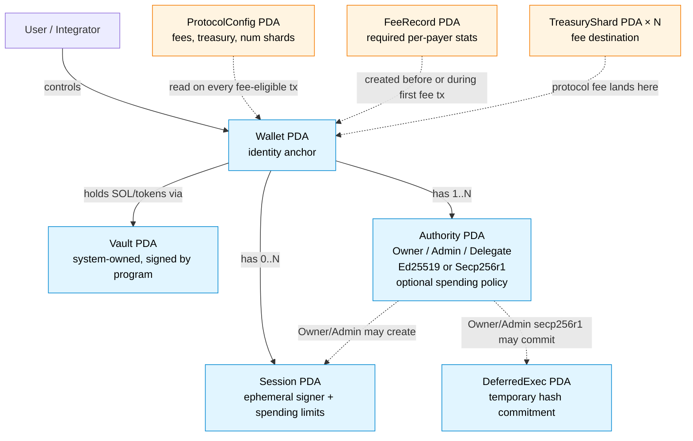
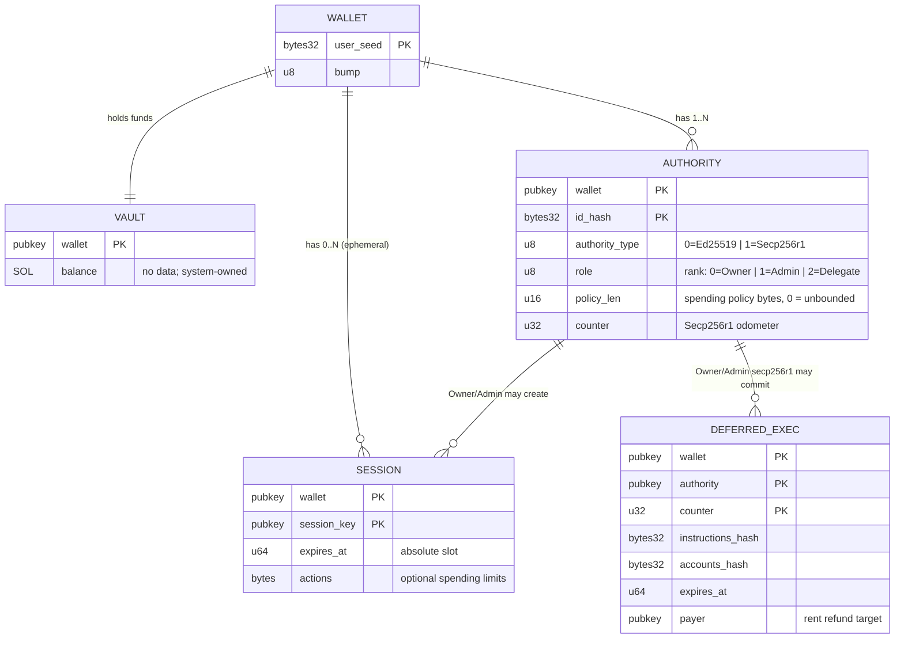
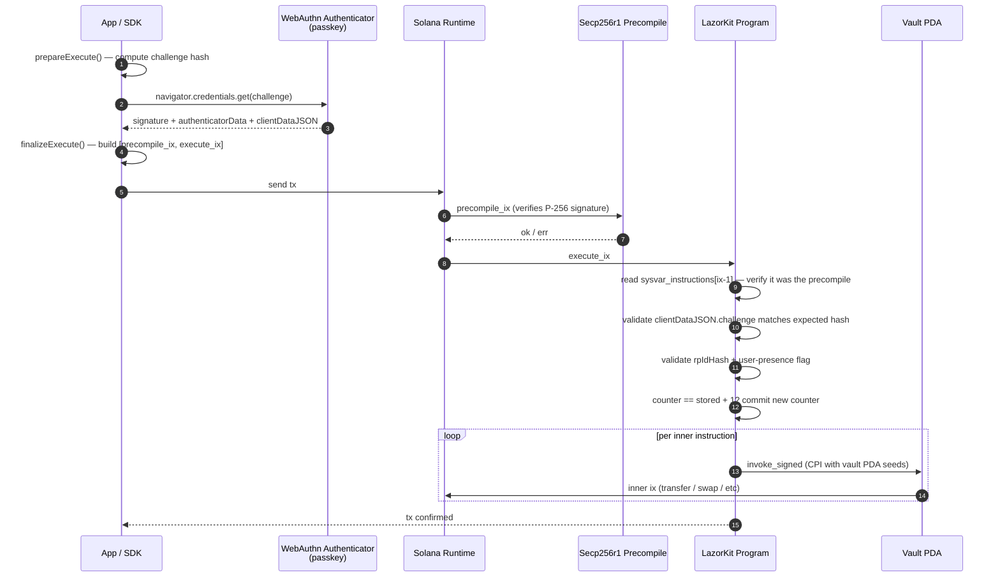
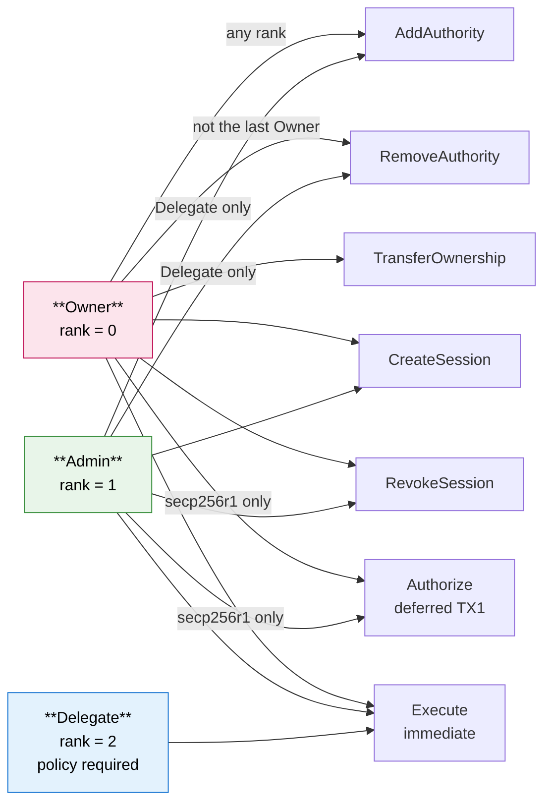
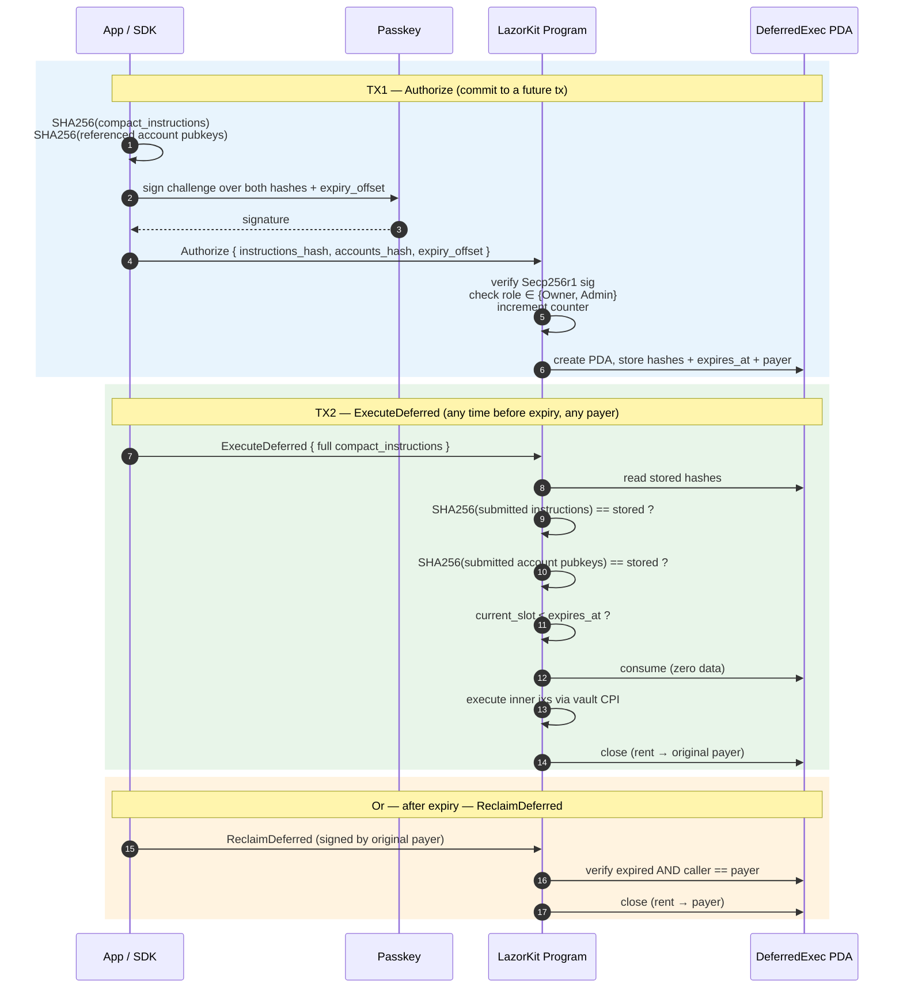

# Architecture

Technical reference for the LazorKit on-chain program. If you just want to use the SDK, see [`sdk/sdk-legacy/README.md`](../sdk/sdk-legacy/README.md).

## Design principles

- **Zero-copy state** — pinocchio casts raw bytes to Rust structs; no Borsh.
- **NoPadding structs** — custom derive ensures memory safety and tight packing.
- **Per-authority storage** — each authority gets its own PDA (no per-wallet list, no resize).
- **Rank and policy are separate** — rank (Owner / Admin / Delegate) says what an
  authority may manage; its policy says what it may spend.
- **Compact instructions** — index-based references for inner CPI accounts.

## Account model at a glance

A LazorKit wallet is a constellation of PDAs. The user-facing identity is the
**Wallet** PDA; assets live in a separate **Vault** PDA; signing power is held
by one or more **Authority** PDAs (each with its own role and auth type);
optional **Session** PDAs delegate scoped signing to ephemeral keys; and
**DeferredExec** PDAs are temporary commitments used for the 2-tx large-payload
flow.


```mermaid
graph TD
    User[User / Integrator] -->|controls| Wallet[Wallet PDA<br/>identity anchor]
    Wallet -->|holds SOL/tokens via| Vault[Vault PDA<br/>system-owned, signed by program]
    Wallet -->|has 1..N| Auth[Authority PDA<br/>Owner / Admin / Delegate<br/>Ed25519 or Secp256r1<br/>optional spending policy]
    Wallet -->|has 0..N| Session[Session PDA<br/>ephemeral signer + spending limits]
    Auth -.->|Owner/Admin may create| Session
    Auth -.->|Owner/Admin secp256r1 may commit| Deferred[DeferredExec PDA<br/>temporary hash commitment]

    Config[ProtocolConfig PDA<br/>fees, treasury, num shards] -.->|read on every fee-eligible tx| Wallet
    FeeRecord[FeeRecord PDA<br/>required per-payer stats] -.->|created before or during first fee tx| Wallet
    Treasury[TreasuryShard PDA × N<br/>fee destination] -.->|protocol fee lands here| Wallet

    classDef pda fill:#e1f5ff,stroke:#0288d1,color:#000
    classDef proto fill:#fff4e1,stroke:#f57c00,color:#000
    class Wallet,Vault,Auth,Session,Deferred pda
    class Config,FeeRecord,Treasury proto
```

The same picture as a relational schema (one row per record type, edges show
"has many" / "has one"):


```mermaid
erDiagram
    WALLET ||--|| VAULT : "holds funds"
    WALLET ||--o{ AUTHORITY : "has 1..N"
    WALLET ||--o{ SESSION : "has 0..N (ephemeral)"
    AUTHORITY ||--o{ SESSION : "Owner/Admin may create"
    AUTHORITY ||--o{ DEFERRED_EXEC : "Owner/Admin secp256r1 may commit"

    WALLET {
        bytes32 user_seed PK
        u8 bump
    }
    VAULT {
        pubkey wallet PK
        SOL balance "no data; system-owned"
    }
    AUTHORITY {
        pubkey wallet PK
        bytes32 id_hash PK
        u8 authority_type "0=Ed25519 | 1=Secp256r1"
        u8 role "rank: 0=Owner | 1=Admin | 2=Delegate"
        u16 policy_len "spending policy bytes, 0 = unbounded"
        u32 counter "Secp256r1 odometer"
    }
    SESSION {
        pubkey wallet PK
        pubkey session_key PK
        u64 expires_at "absolute slot"
        bytes actions "optional spending limits"
    }
    DEFERRED_EXEC {
        pubkey wallet PK
        pubkey authority PK
        u32 counter PK
        bytes32 instructions_hash
        bytes32 accounts_hash
        u64 expires_at
        pubkey payer "rent refund target"
    }
```

Three things worth committing to memory before reading further:

1. The **Vault** is what spends. The **Authority** is what proves you can sign.
   They're separate PDAs.
2. An **Authority** is a key + a role + a wallet. The same key can be an
   Authority on multiple wallets and have a different role on each.
3. **Sessions** and **DeferredExec** are scoped extensions of an Authority's
   power, not separate identities. They're closed when no longer needed.

## Security mechanisms

### Replay protection

- **Secp256r1 odometer counter (primary)** — program-controlled u32 per authority. Client submits `stored + 1`. The WebAuthn hardware counter is intentionally ignored because synced passkeys (iCloud, Google) return unreliable values. Counter is committed only after successful signature verification, and checked arithmetic rejects the terminal `u32::MAX -> 0` wrap case with `ArithmeticOverflow`.
- **Clock-based slot freshness (secondary)** — slot from `auth_payload` must be within 150 slots of `Clock::get()`. No SlotHashes sysvar needed.
- **Anti-CPI check** — `get_stack_height() > 1` rejects authentication via CPI.
- **Signature binding** — challenge hash includes discriminator, payer, the authority's wallet, counter, and program_id. The wallet stops an assertion made for one wallet verifying on another where the same passkey sits at the same counter. The accounts_hash binds the set of inner accounts, preventing recipient-reordering attacks.
- **Ed25519** — standard Solana runtime signer check. No counter (Ed25519 signatures can't replay because they sign over the tx recent blockhash).
- **Sessions** — absolute slot-based expiry, max ~30 days.

### Challenge hash (Secp256r1)

```
SHA256(
  discriminator
  || auth_payload_prefix[14]
  || signed_payload
  || payer
  || wallet
  || counter_le(4)
  || program_id
)
```

7 elements, one `sol_sha256` syscall. `wallet` is the authority header's own `wallet` field (bytes 16..48), not an extra account: every caller has already checked it against the wallet the instruction acts on (for `MigrateWallet`, the v1 wallet). Without it, the signed payloads of `CreateSession`, `AddAuthority` and `TransferOwnership` name no wallet — nor do `Execute`'s and `Authorize`'s when no inner instruction touches an account derived from the wallet — and the payer is typically a relayer shared across wallets. `RevokeSession`, `RemoveAuthority` and `MigrateWallet` sign an account the program then checks belongs to the wallet, so they were bound already; now they are bound directly too. Only the 14-byte prefix of `auth_payload` (`[slot(8)][counter(4)][sysvarIxIdx(1)][reserved(1)]`) is hashed — the rest contains `clientDataJSON`, which is produced by the authenticator **after** signing the challenge, so it can't be in the hash input.

### WebAuthn flow

LazorKit supports only the raw-clientDataJSON flow (what every real browser authenticator produces). The on-chain program:

1. Receives the full `clientDataJSON` bytes from the authenticator.
2. Validates the `type` field is `"webauthn.get"` and the `challenge` field matches `base64url(expected_challenge_hash)`.
3. Hashes the raw bytes to build the precompile signed message.
4. Verifies `rpIdHash` in authenticator data against the on-chain stored `rpIdHash` (constant-time).
5. Checks User Presence (`flags & 0x01`). The WebAuthn hardware counter is not checked.

Programmatic/bot signing should use Ed25519 authorities, not Secp256r1.

### Secp256r1 Execute sequence

End-to-end signing flow for an Execute call signed by a passkey. The SDK and
the on-chain program split signing into a *prepare* phase (compute the
challenge) and a *finalize* phase (assemble the precompile + Execute
instructions after the authenticator signs).


```mermaid
sequenceDiagram
    autonumber
    participant App as App / SDK
    participant WA as WebAuthn Authenticator<br/>(passkey)
    participant SOL as Solana Runtime
    participant PRE as Secp256r1 Precompile
    participant LK as LazorKit Program
    participant V as Vault PDA

    App->>App: prepareExecute() — compute challenge hash
    App->>WA: navigator.credentials.get(challenge)
    WA-->>App: signature + authenticatorData + clientDataJSON
    App->>App: finalizeExecute() — build [precompile_ix, execute_ix]
    App->>SOL: send tx
    SOL->>PRE: precompile_ix (verifies P-256 signature)
    PRE-->>SOL: ok / err
    SOL->>LK: execute_ix
    LK->>LK: read sysvar_instructions[ix-1] — verify it was the precompile
    LK->>LK: validate clientDataJSON.challenge matches expected hash
    LK->>LK: validate rpIdHash + user-presence flag
    LK->>LK: counter == stored + 1? commit new counter
    loop per inner instruction
        LK->>V: invoke_signed (CPI with vault PDA seeds)
        V->>SOL: inner ix (transfer / swap / etc)
    end
    LK-->>App: tx confirmed
```

Two non-obvious points:
- The precompile runs **before** the Execute instruction in the same tx, and
  Execute introspects `sysvar_instructions` to confirm it. Skipping the
  precompile or reordering it triggers `InvalidInstruction`.
- The **odometer counter** (not the WebAuthn hardware counter) is what
  prevents replay. It's bumped only after every other check passes.

## Account layouts

### Discriminators

The high nibble is the protocol major version, so a v1 account fails the
discriminator check immediately rather than being reinterpreted under a layout
that has moved underneath it.

```rust
pub const PROTOCOL_VERSION: u8 = 2;

pub enum AccountDiscriminator {
    Wallet         = 0x21,
    Authority      = 0x22,
    Session        = 0x23,
    DeferredExec   = 0x24,
    ProtocolConfig = 0x25,
    FeeRecord      = 0x26,
    TreasuryShard  = 0x27,
}
```

Every PDA seed carries the same version as a literal prefix — `lk2:wallet`,
`lk2:authority`, and so on. The two mechanisms do different jobs and both are
needed: the seed prefix makes the v2 address space disjoint from v1's, and the
discriminator makes a v1 account that somehow arrives fail loudly. See
[upgrade-procedure.md](upgrade-procedure.md).

### Wallet PDA — 8 bytes

Seeds: `["lk2:wallet", user_seed]`

```rust
#[repr(C, align(8))]
pub struct WalletAccount {
    pub discriminator: u8,   // 0x21
    pub bump: u8,
    pub version: u8,
    pub _padding: [u8; 1],
    pub owner_count: u32,    // authorities on this wallet holding rank Owner
}
```

`owner_count` is what refuses the removal of the last Owner. A wallet with no
Owner is not frozen — its Admins and Delegates keep spending — but nothing can
ever be added or revoked again, so a lost device would stay valid forever.

### Authority PDA

Seeds: `["lk2:authority", wallet_pubkey, id_hash]`

48-byte fixed header + auth-type-specific data + an optional policy:

```rust
#[repr(C, align(8))]
pub struct AuthorityAccountHeader {
    pub discriminator: u8,   // 0x22
    pub authority_type: u8,  // 0=Ed25519, 1=Secp256r1
    pub role: u8,            // rank: 0=Owner, 1=Admin, 2=Delegate
    pub bump: u8,
    pub version: u8,
    pub _padding1: [u8; 3],
    pub counter: u32,        // Secp256r1 odometer
    pub policy_len: u16,     // action buffer length, 0 = unbounded
    pub _padding2: [u8; 2],
    pub wallet: Pubkey,
}
```

Variable data after header:

- **Ed25519**: `[pubkey(32)]` — 80 bytes, plus `policy_len` bytes of policy.
- **Secp256r1**: `[credential_id_hash(32)][compressed_pubkey(33)][rpIdHash(32)]` —
  145 bytes, plus `policy_len` bytes of policy.

`role` is a **rank**: what this authority may *manage*. The policy is what it may
*spend*. They are independent, and conflating them is what made "Spender" a name
for a tier that had full control of the vault — rank was checked at five
management sites and nowhere in `Execute`. A Delegate is required to carry a
policy for exactly that reason; Owner and Admin may carry one optionally.

An authority whose own `policy_len` is non-zero may not add authorities at all.
Comparing two policies to prove a grant is no wider than the granter's is a hard
problem; refusing the grant sidesteps it.

`CreateWallet` and `AddAuthority` reject all-zero Ed25519 pubkeys, all-zero
Secp256r1 credential hashes, and all-zero Secp256r1 compressed pubkeys before
deriving or initializing the Authority PDA. SDK owner/authority helpers apply
the same non-zero identity checks before building create, add, and ownership
transfer instructions; on-chain `TransferOwnership` also rejects an all-zero
authority seed.

`rpIdHash` is pre-computed at authority creation (SHA-256 of the rpId string) and stored directly, eliminating one `sol_sha256` syscall per Execute.

### Session PDA — 80+ bytes

Seeds: `["lk2:session", wallet_pubkey, session_key]`

```rust
#[repr(C, align(8))]
pub struct SessionAccount {
    pub discriminator: u8,   // 0x23
    pub bump: u8,
    pub version: u8,
    pub _padding: [u8; 5],
    pub wallet: Pubkey,
    pub session_key: Pubkey,
    pub expires_at: u64,     // Absolute slot
}
```

Optional **actions** buffer appended after the header (variable length, max 2048 bytes). Each action: 11-byte header `[type(1)][data_len(2 LE)][expires_at(8 LE)]` + type-specific data. Max 16 actions per session or policy, whitelist and blacklist entries included; naming a mint takes one.

| Type | ID | Data | Description |
|---|---|---|---|
| SolLimit | 1 | remaining(8) | Lifetime SOL cap |
| SolRecurringLimit | 2 | limit∥spent∥window∥last_reset(32) | Per-window SOL cap |
| SolMaxPerTx | 3 | max(8) | Max SOL gross outflow per execute |
| TokenLimit | 4 | mint(32)∥remaining(8) | Lifetime token cap per mint |
| TokenRecurringLimit | 5 | mint∥limit∥spent∥window∥last_reset(64) | Per-window token cap |
| TokenMaxPerTx | 6 | mint(32)∥max(8) | Max tokens per execute per mint |
| ProgramWhitelist | 10 | program_id(32) | Allow-list a CPI target (repeatable) |
| ProgramBlacklist | 11 | program_id(32) | Block-list a CPI target (repeatable) |

**Expired-action policy**: expired spending limits are treated as **fully exhausted** (any spend denied); expired whitelists are **hard deny**; expired blacklist entries are silently dropped.

**Vault invariants**: during any policy-bearing Execute — a session with actions,
or an authority with a policy — the program records the vault's owner and data
length, and copies every writable vault-owned token account in the Execute,
before the CPI loop. Afterwards the vault's owner and data length must be
unchanged (3030 / 3031), every copied token account unchanged but for its
balance (3032), and no SOL or mint the policy does not name may have left
(3037 / 3038). This prevents escape via `System::Assign`, SPL Token
`SetAuthority`, `Approve`, `CloseAccount` or `FreezeAccount`, and spending an
asset the granter never listed. The full rule set is in
[What a policy bounds](#what-a-policy-bounds).

### DeferredExec PDA — 176 bytes

Seeds: `["deferred", wallet_pubkey, authority_pubkey, counter_le(4)]`

```rust
#[repr(C, align(8))]
pub struct DeferredExecAccount {
    pub discriminator: u8,           // 4
    pub version: u8,
    pub bump: u8,
    pub _padding: [u8; 5],
    pub instructions_hash: [u8; 32], // SHA256 of compact instructions
    pub accounts_hash: [u8; 32],     // SHA256 of referenced account pubkeys
    pub wallet: Pubkey,
    pub authority: Pubkey,
    pub payer: Pubkey,               // Receives rent refund on close
    pub expires_at: u64,
}
```

Temporary account created during `Authorize` (tx1), closed during `ExecuteDeferred` (tx2). The authority's odometer counter is used as a seed nonce, so each authorization gets a unique PDA. Expired authorizations can be reclaimed via `ReclaimDeferred`.

### Vault PDA

Seeds: `["lk2:vault", wallet_pubkey]`

No data allocated. Holds SOL as a System-owned account (`data_len = 0`, `owner = SystemProgram`). Program signs for it via PDA seeds during Execute/ExecuteDeferred.

### Protocol fee accounts

LazorKit's entrypoint can collect fees before dispatching to `CreateWallet` / `Execute` / `ExecuteDeferred` processors.

```rust
// ProtocolConfig PDA ["lk2:protocol_config"] — 120 bytes, disc 0x25
pub struct ProtocolConfig {
    pub discriminator: u8, pub version: u8, pub bump: u8,
    pub enabled: u8, pub num_shards: u8, pub _padding: [u8; 3],
    pub admin: Pubkey, pub treasury: Pubkey,
    pub creation_fee: u64, pub execution_fee: u64,
    pub pending_admin: Pubkey,   // two-step rotation; default = none pending
}

// Either fee is capped at MAX_PROTOCOL_FEE_LAMPORTS (0.01 SOL). Without a
// ceiling, execution_fee = u64::MAX is a freeze wearing a fee's clothes:
// nobody can pay it, discriminators 4 and 7 are the only paths that move funds
// out of a vault, and the config still reads as enabled.

// FeeRecord PDA ["lk2:fee_record", payer_pubkey] — 32 bytes, disc 0x26
// Per-payer reward-tracking counters.

// TreasuryShard PDA ["lk2:treasury_shard", shard_id_u8] — 8 bytes, disc 0x27
// Sharded fee destination (N shards spread write contention).
```

Fee flow: SDK appends `[protocolConfig, feeRecord, treasuryShard, systemProgram]` to fee-eligible instructions and prepends `RegisterPayer` when the payer/paymaster is missing its canonical `FeeRecord`. Entrypoint validates the canonical config, fee record, and treasury shard PDAs, creates the `FeeRecord` inline if the canonical account is still system-owned, transfers `fee` from payer to a random `treasuryShard`, bumps `FeeRecord` counters, then strips the 4 accounts and dispatches to the processor. Admin withdraws from shards to `treasury` via `WithdrawTreasury`.

**When fees are not configured, collection is skipped — the instruction is not
rejected.** This was C-1. The entrypoint used to revert every discriminator 0, 4
and 7 when the config was disabled or the fee was zero, and those are the only
paths that move funds out of a vault: a single admin write froze every user's
funds, and nothing in the protocol could undo it. Skipping is safe because the
config PDA address is pinned first, so "not configured" cannot be spoofed by
passing a different account.

## Auth payload layout (Secp256r1)

```
[slot(8)]                   // 8 bytes — Clock-based slot freshness
[counter(4)]                // 4 bytes — odometer value (stored + 1)
[sysvar_ix_index(1)]        // 1 byte  — index of sysvar_instructions in accounts
[reserved(1)]               // 1 byte  — set to 0x80 (legacy mode marker)
[auth_data_len(2 LE)]       // 2 bytes
[authenticator_data(M)]     // M bytes — WebAuthn authenticator data (≥ 37)
[cdj_len(2 LE)]             // 2 bytes
[client_data_json(N)]       // N bytes — raw clientDataJSON from authenticator
```

The first 14 bytes form the deterministic prefix that's hashed into the challenge. Everything after is bound into the signature via the precompile's signed message (`authenticatorData ∥ SHA256(clientDataJSON)`).

## Rank and policy

Two independent questions, deliberately kept apart:

- **Rank** (`role` in the header) — what this authority may *manage*.
- **Policy** (the action buffer after the key material) — what it may *spend*.

They used to be one field, and that was the bug. `role` gated management at five
sites and gated `Execute` nowhere, so an authority named "Spender" could move the
entire vault; the name described a restriction the program never applied. Rank
now says nothing about spending, and the policy says nothing about management.

### Rank

| Rank | Value | May add | May remove |
|---|---|---|---|
| Owner | 0 | Owner, Admin, Delegate | Owner (not the last), Admin, Delegate |
| Admin | 1 | Delegate | Delegate |
| Delegate | 2 | nothing | nothing |

Enforced by `can_add` and `can_remove` in `processor/authority/manage.rs`, which
are pure functions table-tested over every pair.


```mermaid
flowchart LR
    Owner["**Owner**<br/>rank = 0"]
    Admin["**Admin**<br/>rank = 1"]
    Delegate["**Delegate**<br/>rank = 2<br/>policy required"]

    Add[AddAuthority]
    Remove[RemoveAuthority]
    Transfer[TransferOwnership]
    CreateS[CreateSession]
    RevokeS[RevokeSession]
    Authorize[Authorize<br/>deferred TX1]
    Exec[Execute<br/>immediate]

    Owner -->|any rank| Add
    Owner -->|not the last Owner| Remove
    Owner --> Transfer
    Owner --> CreateS
    Owner --> RevokeS
    Owner -->|secp256r1 only| Authorize
    Owner --> Exec

    Admin -->|Delegate only| Add
    Admin -->|Delegate only| Remove
    Admin --> CreateS
    Admin --> RevokeS
    Admin -->|secp256r1 only| Authorize
    Admin --> Exec

    Delegate --> Exec

    classDef owner fill:#fce4ec,stroke:#c2185b,color:#000
    classDef admin fill:#e8f5e9,stroke:#388e3c,color:#000
    classDef delegate fill:#e3f2fd,stroke:#1976d2,color:#000
    class Owner owner
    class Admin admin
    class Delegate delegate
```

Rules the diagram cannot show:

- **A wallet may have several Owners.** This is the multi-device case: each
  device holds its own passkey, passkeys cannot be copied, so several devices
  means several authorities — and only if they are all Owners can a surviving
  device revoke a lost one. `WalletAccount::owner_count` tracks how many there
  are.
- **The last Owner cannot be removed.** A wallet with no Owner still spends, but
  nothing can ever be added or revoked again. In practice a removal always
  leaves its author standing (removing an Owner requires an Owner, and
  self-removal is refused), so the count is the belt to that braces.
- **A Delegate must carry a policy**, and **an authority carrying a policy may
  not add authorities at all** — proving a grant is no wider than the granter's
  is a hard problem, and refusing the grant sidesteps it.
- `TransferOwnership` still exists and still swaps atomically. It is the only way
  to hand ownership to a key that does not exist yet, and the only way for a sole
  Owner to stop being one without leaving the wallet ownerless. It leaves
  `owner_count` unchanged: one Owner goes, one arrives.
- `ExecuteDeferred` and `ReclaimDeferred` are not gated by rank — by hash match
  and payer pubkey respectively. Anyone may submit TX2; only the original payer
  may reclaim after expiry.

### Policy

An authority with `policy_len > 0` runs the same action engine a session does,
on the same path: pre-action snapshot, execute, post-action evaluation against
vault deltas and the vault's token accounts. The action types are shared — `SolLimit`,
`SolRecurringLimit`, `SolMaxPerTx`, the `Token*` equivalents,
`ProgramWhitelist`/`ProgramBlacklist`.

An authority with `policy_len == 0` is unbounded and spends like an Owner. That
is intended for Owner and Admin; it is refused for Delegate.

**A session with zero actions is likewise unbounded** — no actions means no
policy engine runs, so the session key can spend the vault freely until
expiry. Creating one still requires Owner/Admin authorization, but "session"
does not imply "limited": attach actions, and the SDK should refuse to build
a zero-action session without an explicit opt-in.

#### What a policy bounds

**A policy names what may leave the vault, and SOL or a mint it does not name
may not.** Precisely: for any Execute whose signer carries a policy, the vault's
net SOL and its net balance of each mint, measured over the token accounts it
owned before the CPIs, cannot fall unless an action names that asset. Before
D13 a policy bounded only what its actions covered: a `ProgramWhitelist` with no
`SolLimit` left SOL uncapped, and a `TokenLimit(USDC)` left every other mint the
vault held uncapped. A whitelist-only policy now moves no value at all; it can
still call programs that move none, or that pay the vault.

What the program checks, after the CPI loop, in this order (state is written
only once all pass):

| | Invariant | Error |
|---|---|---|
| I-0 | The vault's owner and data length are unchanged. | 3030 / 3031 |
| I-1 | *S* is every writable token account in the Execute that the vault owned before the loop, once per key. A token account here is owned by SPL Token or Token-2022, initialised (state 1 or 2), and not a mint or multisig (SPL Token: exactly 165 bytes; Token-2022: 165, or longer, not 355, with account type 2). Read-only accounts cannot change, so they are left out. | — |
| I-2 | Each account in *S* still has lamports, is still a token account of the same length, and has the same mint, owner, delegate, state, is_native and close authority. `delegated_amount` may fall, not rise. Its lamports may fall only by what a native (wSOL) account's `amount` fell by. `amount` is free. | 3032 |
| I-3 | A writable token account that is vault-owned after the loop but is not in *S* carries no delegate and no close authority. | 3032 |
| I-4 | A mint a `Token*` action names (expired or not): its outflow is its balance summed over *S* before, less after (saturating), charged against the limits as before. | 3026 / 3027 / 3029 |
| I-5 | A mint no `Token*` action names: its balance summed over *S* may not fall. | 3038 |
| I-6 | SOL: any `Sol*` action names it, and the limits apply as before (`SolMaxPerTx` on gross outflow, `SolLimit` and `SolRecurringLimit` on net). With no `Sol*` action, the vault's lamports may not fall. | 3023–3025 / 3037 |

Consequences worth stating:

- **Net, per asset.** An Execute that sends some of a mint out and gets as much
  back passes, as does moving a mint between two vault accounts. There is no
  netting across mints. Gross accounting for unnamed assets was considered and
  rejected: it would refuse the temporary wSOL account a swap creates and closes
  back to the vault.
- **Rent is SOL.** With no `Sol*` action, the vault cannot pay rent for a new
  account, so a policy for swaps either names SOL or relies on the output ATA
  existing already — created in a top-level instruction the fee payer funds,
  before the Execute.
- **wSOL is a mint.** `SolLimit` does not cover wSOL, and `TokenLimit(wSOL)`
  does not cover SOL. Wrapping spends SOL; unwrapping or sending wSOL spends
  wSOL.
- **A new vault account is spent, not kept.** Tokens moved into a token account
  that became vault-owned during the Execute are charged, because "after" is
  measured over *S* only. Before D13, "after" covered every account vault-owned
  at the end, so a session could move a listed mint into an account it had just
  initialised for the vault, uncharged, and `Approve` itself on it.
- **Inflows always pass**, of any asset, and are never credited across assets.
- **A delegate spending its full allowance** inside the Execute clears the
  delegate field, which I-2 refuses. It fails closed; no session flow does it.

**No opt-out.** There is no action that lifts the rule, and none is reserved:
an escape hatch is the first thing a malicious app would ask for. A signer that
must move arbitrary assets is an unbounded one — an Owner, an Admin, or a
session created with no actions, which both SDKs make an explicit opt-in. A
future opt-out would be a new action type; today's `from_u8` refuses unknown
types with 3020, so no stored buffer could change meaning.

**What it does not reach.** Any value the vault controls through its signature,
other than its own lamports and the base fields of the token accounts it owns,
is bounded only by the program whitelist, one call level deep (M-7). That
includes:

- mint, freeze and close authority of mints the vault controls, and Token-2022
  authorities it holds (permanent delegate, withdraw-withheld);
- the upgrade authority of a program;
- stake and nonce accounts it is authority of, lamports in system accounts at
  addresses derived with the vault as base, and Address Lookup Tables it owns;
- positions in other programs (lending, perps, open orders), and program-owned
  accounts whose close or rent destination the vault signs for;
- Metaplex Core assets and compressed NFTs;
- allowances third parties approved to the vault;
- Token-2022 confidential balances, and extension state on its token accounts:
  extension bytes are not compared, so owner-signed extension changes (memo
  transfer, CPI guard, confidential-transfer configuration) pass. None of them
  lowers the public `amount`.

Value any of these releases into the vault during the Execute counts as an
inflow, and can then leave as that asset, named or not, netting against it:
borrowing against collateral or withdrawing stake to the vault and sending it
on passes with no SOL or token action. Excess lamports in a token account the
Execute does not pass writable cannot move at all.

**Only a Delegate may carry a policy.** `AddAuthority` requires one for rank
Delegate (3033) and refuses one above it (3035), and the three sites that write
an authority — wallet creation, AddAuthority, TransferOwnership — are the only
ones that set `policy_len`. So `policy_len != 0` means exactly `rank ==
Delegate` for every authority the program will ever write. A bounded Owner was
otherwise a dead end: it could remove the unbounded Owner, and then widen
nothing — no AddAuthority, no CreateSession, no TransferOwnership, no
Authorize — so when its allowance ran out the wallet was unmanageable with its
funds still inside. A bounded Admin was the shape every escalation guard below
was written against. A capped spender is a Delegate; a manager is an Admin; one
key is no longer both.

Four instructions refuse a policy-bearing authority outright rather than
silently ignoring its limits, because none of them can enforce a policy. With
the rank rule above they are now defence in depth against a bounded authority
arriving by some other route, rather than a live gate:
`AddAuthority` (a bounded authority may not grant), `Authorize`/deferred
execution (no action engine), `CreateSession` (a session carries its own action
buffer, which may be empty, so a bounded Admin could otherwise mint an unbounded
key) and `TransferOwnership` (the new owner is written `policy_len = 0`, so a
bounded Owner could otherwise shed its own bound).

The rule those four implement is worth stating directly, because it is narrower
than "a bounded authority may only Execute": **a bounded authority may narrow
the authority set but never widen it.** `RemoveAuthority` and `RevokeSession`
deliberately carry no policy check — a bounded Admin can still revoke a Delegate
or kill a session, which takes power away and can never grant it. It cannot then
recreate what it removed.

## Execute signer forwarding

An inner instruction sometimes legitimately needs a signature that is not the
vault's — a co-signer, a market account, a second party to a swap. `Execute`
used to supply those by forwarding *every* signer on the outer transaction into
every inner CPI, which included the fee payer.

That was H-3. A session restricted to a 0.001 SOL lifetime allowance could move
2 SOL out of the paymaster's own wallet: nothing was bypassed, because the action
limits watch the vault and the paymaster is a different account whose signature
`try_collect_fee` requires anyway.

Forwarding is now **opt-in per account**, requested by bit 7 of that account's
index byte inside the compact instruction, and bounded by two rules the bit
cannot override:

- **The fee payer is never forwarded**, compared by key so listing it twice
  cannot launder it.
- **A session may forward only its own session key.**

The second rule exists because the bit is not consent on the session path. For a
Secp256r1 authority the compact bytes sit inside the signed payload, so setting
the bit is something the passkey holder signs. A session key signs no payload —
it is the adversary in this finding — and would simply set the bit itself.

The vault signs unconditionally and needs no flag: the program signs for it with
seeds rather than forwarding anything.

A paymaster is therefore no longer required to audit inner instructions for
conscription of its own signature. It should still parse the transaction for the
usual reasons — it is paying for it.

```mermaid
sequenceDiagram
    autonumber
    participant App
    participant LK as LazorKit Program
    participant Auth as Authority PDA
    participant V as Vault PDA

    App->>LK: Execute { compact_ixs, auth_payload }
    LK->>Auth: read header (rank, type, counter, policy_len)
    Note over LK,Auth: Execute does not gate on rank.<br/>It gates on the policy, if there is one.
    LK->>LK: authenticate (Ed25519 signer check OR Secp256r1 odometer + WebAuthn)
    LK->>LK: copy vault + its token accounts (policy present)
    LK->>V: invoke_signed (vault seeds; flagged signers forwarded)
    V-->>App: inner ix executes
    LK->>LK: evaluate post-actions against the deltas
    LK-->>App: ok ✓

    rect rgb(255,235,235)
    Note over App,LK: The same Delegate calling AddAuthority:
    App->>LK: AddAuthority { ... }
    LK->>Auth: read rank
    LK-->>App: PermissionDenied (3002) ✗
    end
```

## Instruction reference

Wallet operations:

| Disc | Instruction | Description |
|---|---|---|
| 0 | CreateWallet | Create wallet + vault + first authority |
| 1 | AddAuthority | Add Ed25519/Secp256r1 authority at a rank, with an optional policy. **Wallet account writable** |
| 2 | RemoveAuthority | Remove authority; refund rent. **Wallet account writable** |
| 3 | TransferOwnership | Atomic owner swap |
| 4 | Execute | Execute compact instructions via CPI with vault signing |
| 5 | CreateSession | Create session key (optional actions) |
| 6 | Authorize | Deferred TX1 — store instruction/account hashes |
| 7 | ExecuteDeferred | Deferred TX2 — execute and close |
| 8 | ReclaimDeferred | Close an expired DeferredExec, refund rent |
| 9 | RevokeSession | Close a session early, refund rent |

Protocol admin instructions (admin-only):

| Disc | Instruction |
|---|---|
| 10 | InitializeProtocol |
| 11 | UpdateProtocol |
| 12 | RegisterPayer |
| 13 | WithdrawTreasury |
| 14 | InitializeTreasuryShard |
| 15 | ProposeProtocolAdmin |
| 16 | AcceptProtocolAdmin |

Admin rotation is two-step: the sitting admin proposes, the named successor
accepts. Proposing `Pubkey::default()` cancels. A single-step write would make a
typo permanent, and there is nothing above the admin to undo it.

Every admin instruction pins the ProtocolConfig **address** as well as its owner
and header, via `ProtocolConfig::load`, before reading any field for an
authorization decision.

The entrypoint refuses to run at all if the program is deployed at an address
other than the one compiled into it.

## Compact instruction format

Binary format packed into the Execute instruction data:

```
[num_instructions(1)]       // Max 16
For each:
  [program_id_index(1)]     // Index into tx accounts, bit 7 clear
  [num_accounts(1)]
  [account_indexes(N)]      // 1 byte each: bits 0-6 index, bit 7 forward-signer
  [data_len(2 LE)]
  [instruction_data(M)]
```

Indexes replace 32-byte pubkeys with 1-byte references, shrinking a Secp256r1
Execute from ~1.2KB uncompressed to ~800 bytes.

**Bit 7 of an account index byte** requests that this account's signer privilege
be forwarded into the inner CPI. That caps the addressable account list at 128;
an index of 128 or above is rejected rather than masked, because masking would
silently point the instruction at a different account. See
[Execute signer forwarding](#execute-signer-forwarding) for the rules that bound
the request.

**Accounts hash** — for Secp256r1 the signed payload includes a SHA-256 over
every account each compact instruction references: for each instruction in order,
the program id account then each referenced account, each contributing its
32-byte key **followed by one flags byte** (bit 0 `is_signer`, bit 1
`is_writable`). The forward-signer bit is masked off before lookup, so requesting
forwarding does not change the digest.

The flags are the runtime's, which are per key over the whole message, not what
any one instruction declared: the fee payer is always a writable signer, a key
listed twice has the union of its entries, and the runtime demotes a reserved
account or an invoked program id to read-only whatever any list says. A client
has to predict them. The SDKs model the instruction's own list and the fee
payer: they declare the Execute payer writable (as the IDL does), take a
`feePayer` when another key pays the fee, and merge a repeated key's flags
before hashing. Authorize's tx2 layout has tx2's payer at index 0 and the
Authorize payer — the only refund destination the program accepts — at index
4, where inner references to it resolve; it is a signer there only if it also
sends tx2, so `prepareAuthorize` takes the `executor` that will, and the
deferred payload records it. The rest — another top-level instruction listing a
key with more privilege, the protocol-fee accounts appended after the remaining
accounts, the runtime's demotions — is the caller's to account for. A wrong
guess fails closed: the program refuses with 3005 (3015 for ExecuteDeferred) and
nothing runs.

The flags byte is M-4. Binding only the keys left the privileges for the relayer
to choose: it could take an account the passkey holder had approved as read-only
and submit it writable. Golden vectors for the exact encoding live in
[`test-vectors/accounts-hash.json`](../test-vectors/accounts-hash.json), asserted
against by the program and by both SDKs — a divergence there fails as a unit test
naming the mismatched byte, rather than as an unexplained `InvalidMessageHash`
against a validator.

## Parallel execution

Different authorities on the same wallet can execute **in parallel** on Solana's scheduler:

| Account | Access | Shared? |
|---|---|---|
| Authority PDA | writable (counter++) | No — per-authority |
| Wallet PDA | read-only | Yes, but no write lock |
| Vault PDA | signer-only (CPI) | Yes, but no write lock |

Two different authorities on the same wallet have different writable PDAs → Solana's scheduler runs them concurrently. Same authority in two txs → counter conflict → serialized.

This means admins, spenders, and session keys can all operate on the same wallet without blocking each other.

## Deferred execution

2-transaction flow for payloads too large for a single Secp256r1 Execute (e.g., Jupiter swaps). A v0 transaction is capped at 1232 bytes, and a passkey Execute with no inner instruction already takes about 887 of them (portal clientDataJSON, no ALT, no ComputeBudget instruction). That leaves about 345 bytes for inner instructions, about 305 with a compute-unit limit, and under 200 when Chrome pads clientDataJSON (+109 bytes). Even a single-hop SOL→USDC Jupiter route does not fit from the portal: 1521 bytes with a compute-unit limit, 1245 with Jupiter's ALTs as well. Measured 2026-09-29 with sdk-legacy 1.2.0 and cross-checked against devnet transactions.

Under [transaction v1](#transaction-v1-simd-0385) (4096 bytes, 64 addresses) this is no longer a size workaround. tx2 is held to the same 64-address cap as a direct Execute, and addresses run out before bytes, so deferring buys almost no room there (BONK→WIF: 58 addresses as tx2, 59 as a direct Execute); the measured Jupiter routes fit a direct Execute. What deferring still gives is the separation of signing from sending — in time, within the expiry window, or to another sender such as a relayer or a second device.

1. **TX1 (Authorize)** — signer computes `instructions_hash = SHA256(compact_instructions)` and `accounts_hash = SHA256(referenced_pubkeys)`. These are signed via Secp256r1 and stored in a `DeferredExec` PDA. Odometer counter is incremented.
2. **TX2 (ExecuteDeferred)** — any payer submits the full compact instructions. Program verifies both hashes, consumes the `DeferredExec` authorization (zeroes its data before any CPI, so nothing reached from the inner instructions can replay it), executes via CPI with vault signing, and only then moves its rent to the original payer. The rent moves last because the runtime syncs a caller's lamport writes into a CPI only for the accounts that CPI is handed: credited earlier, the refund would cross into any inner instruction that names the payer — a paymaster being repaid — without the matching debit, and the CPI would fail with `UnbalancedInstruction`.


```mermaid
sequenceDiagram
    autonumber
    participant App as App / SDK
    participant WA as Passkey
    participant LK as LazorKit Program
    participant DPDA as DeferredExec PDA

    rect rgb(232,244,253)
    Note over App,DPDA: TX1 — Authorize (commit to a future tx)
    App->>App: SHA256(compact_instructions)<br/>SHA256(referenced account pubkeys)
    App->>WA: sign challenge over both hashes + expiry_offset
    WA-->>App: signature
    App->>LK: Authorize { instructions_hash, accounts_hash, expiry_offset }
    LK->>LK: verify Secp256r1 sig<br/>check role ∈ {Owner, Admin}<br/>increment counter
    LK->>DPDA: create PDA, store hashes + expires_at + payer
    end

    rect rgb(232,245,233)
    Note over App,DPDA: TX2 — ExecuteDeferred (any time before expiry, any payer)
    App->>LK: ExecuteDeferred { full compact_instructions }
    LK->>DPDA: read stored hashes
    LK->>LK: SHA256(submitted instructions) == stored ?
    LK->>LK: SHA256(submitted account pubkeys) == stored ?
    LK->>LK: current_slot ≤ expires_at ?
    LK->>DPDA: consume (zero data)
    LK->>LK: execute inner ixs via vault CPI
    LK->>DPDA: close (rent → original payer)
    end

    rect rgb(255,243,224)
    Note over App,DPDA: Or — after expiry — ReclaimDeferred
    App->>LK: ReclaimDeferred (signed by original payer)
    LK->>DPDA: verify expired AND caller == payer
    LK->>DPDA: close (rent → payer)
    end
```

Properties:
- Odometer counter provides a unique PDA seed per authorization.
- Expiry window: 10–9,000 slots (~4 s to ~1 h).
- Only a Secp256r1 Owner or Admin can authorize — not Ed25519, not a Delegate.
- If TX2 never runs, the original payer can reclaim rent after expiry via `ReclaimDeferred`.

## Transaction v1 (SIMD-0385)

SIMD-0385 adds a transaction format, v1. It raises the size cap to 4096 bytes
(v0: 1232) and keeps the 64-account cap. It has no address lookup tables, and
it carries the compute-unit limit, the loaded-accounts-data limit and the
priority fee in a config inside the message, not in ComputeBudget
instructions. Its feature is active on devnet.

The program runs under it unchanged. On 2026-09-30, against the deployed devnet
program `57bTNW…` (solana-core 4.3.0), all of these landed as v1: CreateWallet
(passkey and Ed25519), passkey and Ed25519 Execute, Authorize and
ExecuteDeferred, Jupiter-sized Executes up to 59 addresses, and a 64-address
Execute of exactly 4096 bytes. The passkey counter rose by exactly one per
operation, and the precompile check at `current_index - 1` behaved as under v0.
The instructions came from sdk-legacy 1.3.1 unchanged and were compiled by
`@solana/kit` 8.4.0; sdk-legacy's own transaction helpers (`buildLegacyTx`,
`buildV0Tx`) build legacy and v0 only.

**Room.** A passkey Execute has 11 fixed addresses — payer, wallet, authority,
vault, program, Secp256r1, the Instructions sysvar, System and the three
protocol-fee accounts — which leaves 53 for the payload's programs and
accounts. For real payloads that cap binds first and bytes second. The RPC
refuses a 4097-byte or a 65-address transaction (-32602). Measured sizes, the
passkey rows with the portal's clientDataJSON:

| Transaction | v1 bytes / addresses |
|---|---|
| Passkey Execute, one transfer | 957 / 12 |
| Ed25519 Execute (two signers) | 573 / 11 |
| Authorize (tx1) | 904 / 9 |
| Passkey Execute, SOL→USDC route | 1,526 / 26 |
| Passkey Execute, JUP→POPCAT route | 2,294 / 49 |
| Passkey Execute, BONK→WIF route | 2,660 / 59; 2,769 when Chrome pads clientDataJSON |
| ExecuteDeferred (tx2), BONK→WIF route | 2,213 / 58 |
| Passkey Execute, 64 addresses and 1,386 bytes of inner data | 4,096 / 64 |

None of the three routes fits a v0 transaction as a direct Execute, even with
Jupiter's ALTs. They are replays: Jupiter's swap instructions with each program
id replaced by SPL Noop and the real id kept as a read-only account (one
address more than the real route). The account lists and data are real, but
only LazorKit's side of the CPI loop ran, not the AMMs. The sizes include a
20-byte config (a 4-byte mask, an 8-byte priority fee, and 4 bytes each for the
compute-unit and loaded-data limits); without a priority fee it is 8 bytes
smaller.

**Program limits a v1 payload can reach.** Real payloads rarely reached two
of the program's ceilings in 1232 bytes. A v1 payload can reach both, and both
fail the transaction:

- **16 inner instructions** (`MAX_COMPACT_INSTRUCTIONS`,
  `program/src/compact.rs`). A 17th fails with `InvalidInstructionData`.
- **A fixed 32 KiB heap.** The allocator hands out 32 KiB from the top down
  and never frees; its cursor takes the lowest 8 bytes, which leaves 32,760.
  A v1 `heapSize` request does not change it. A payload that needs more fails
  with `ProgramFailedToComplete` ("memory allocation failed, out of memory").
  What a payload needs depends on the instruction that runs it, and no rule on
  account-meta counts alone describes it: on a passkey Execute one inner
  instruction of 127 metas runs, while 16 inner instructions of 16 metas each
  do not. For a passkey Execute without a policy, the program as devnet's
  `57bTNW…` runs it (`3584aec7…`; D13 leaves this path's allocations as they
  were) allocates, in this order:
  1. the parsed inner instructions, 40 bytes each;
  2. the accounts-hash preimage: 33 bytes for each inner instruction's program
     and for each of its metas, in a buffer that starts at 132 bytes per
     inner instruction and doubles whenever it fills, every outgrown copy
     kept (`accounts_hash_preimage_with`, `program/src/compact.rs`);
  3. the signed payload (the compact instructions plus 32 bytes) and the
     44-byte base64url challenge;
  4. the account-meta (16 bytes each) and CPI-account (56 bytes each)
     buffers, reused across the inner instructions: room for 32 of each,
     and a new allocation of double the size each time an instruction has
     more metas than they hold;
  5. for each inner instruction, its accounts (8 bytes per meta) and their
     signer flags (1 byte per meta).

  Each byte buffer can add up to 7 bytes of alignment. ExecuteDeferred
  skips item 3, and an Ed25519 or session Execute skips items 2 and 3. A
  policy on the authority or session adds, from D13 on, `2 × 32·a + 240·t`
  bytes: its `a` actions parsed twice (once before the CPIs, once after,
  each sized exactly), and for each of the `t` unique writable vault-owned
  token accounts in the Execute a 192-byte copy and at most one 48-byte mint
  entry. At `a = 16`, `t = 8` that is 2,944 bytes. The table below does not
  include it. For k equal inner instructions, each with 12 bytes of data, the
  most metas each can have:

  | Inner instructions (k) | Passkey Execute | ExecuteDeferred | Ed25519 or session Execute |
  |---|---|---|---|
  | 1 | 127 | 127 | 128 |
  | 2 | 64 | 64 | 128 |
  | 3–5 | 63 | 63 | 128 |
  | 6 | 32 | 32 | 128 |
  | 7–12 | 31 | 31 | 128 |
  | 13 | 29 | 31 | 128 |
  | 14 | 15 | 16 | 127 |
  | 15–16 | 15 | 15 | 118 at 15, 110 at 16 |

  More instruction data leaves less room on a passkey Execute (item 3). The
  sum agrees with every payload measured against that build, on both sides of
  the limit. On devnet, all passkey Executes: 127 metas, 64 + 64, 100 + 20,
  60 + 60 + 10, 80 + 5 × 8, 5 × 30 and 16 × 12 ran; 128 to 200 metas,
  70 + 70 to 120 + 120 and 100 + 30 ran out of memory. On our own validator
  running `3584aec7…`, 47 runs over all three paths, among them 16 × 16,
  8 × 32 and 16 × 24, which ran out of memory on a passkey Execute and ran on
  an Ed25519 Execute (16 × 16 also ran out on ExecuteDeferred). On the passkey
  path it agrees to the byte: payloads that need 32,757, 32,759 and 32,760
  bytes ran, and 32,765, 32,767 and 32,768 did not. The wallet packages' v1
  path computes this sum (`lazorkitHeapBytes`) and refuses a payload over
  32,760 bytes before asking for a signature. By it the measured route replays
  need 8,756 bytes (SOL→USDC), 15,976 (JUP→POPCAT) and 25,456 (BONK→WIF,
  83 + 7 metas) on a passkey Execute. A build that sizes these buffers exactly
  from the parsed instructions allocates less for any payload.

**Config.**

- **Set both limits.** A v1 transaction whose compute-unit limit or
  loaded-data limit is unset or zero is not refused up front: it lands as a
  failure and the fee payer is charged the full fee, priority fee included. A
  sponsor has to refuse it before signing, reading the limits from the
  message's config.
- **Size the limits from a simulation.** A passkey Execute with one transfer
  took 13,011 CU (the [Compute cost](#compute-cost) table predates it); each
  extra inner instruction adds about 1.8k and each inner account meta 280–380,
  before the inner programs' own compute. The most observed was 107,163 (16
  inner instructions × 12 metas). Loaded data counts 64 bytes plus the data
  length of every existing account the transaction loads, and 64 bytes plus the
  programdata length once per upgradeable program. Every LazorKit transaction
  loads 160,992–161,337 bytes on devnet, almost all of it the program's own
  programdata, so it needs a limit of about 161 KB (163,840 in 32 KiB pages)
  before any payload. The three routes load 414,796, 490,044 and 2,407,845
  bytes in total on devnet; computed from mainnet state, the routes alone
  need 3.68, 5.54 and 16.07 MB, so size per route and per cluster.
  `simulateTransaction` returns both `unitsConsumed` and
  `loadedAccountsDataSize`. A bigger programdata raises every transaction's
  load: see [upgrade-procedure.md](upgrade-procedure.md#6-deploy).
- **No ComputeBudget instructions.** In a v1 transaction they configure
  nothing (their limits and prices are ignored) and still cost 150 CU each.
  One placed between the Secp256r1 precompile and the LazorKit instruction
  fails with 3003, because the program reads the precompile at
  `current_index - 1`.
- **Fee.** It does not depend on the limits: 5,000 lamports per transaction
  signature and per precompile signature (10,000 for a passkey Execute), plus
  the priority fee, which in v1 is a total in lamports, not a price per
  compute unit. The two priority-fee mask bits are set together or not at all;
  the RPC refuses one alone.

## Compute cost

See `docs/` for benchmarks. Top-line numbers on hot paths:

| Path | CU | Notes |
|---|---|---|
| Normal SOL Transfer (baseline) | 150 | Solana runtime minimum |
| Execute (Session key) | ~4,100 | No precompile, no auth payload |
| Execute (Secp256r1 passkey) | ~9,440 | Includes ~2,300 CU Secp256r1 precompile |
| Execute (Ed25519 authority) | ~5,900 | No precompile |
| CreateWallet (Ed25519 or Secp256r1) | ~15-20K | One-time |

All paths fit comfortably within Solana's 200K CU default budget.

The precompile alone is a 2,300 CU floor on Secp256r1 Execute; the remaining
~7,100 CU covers account validation, odometer counter, challenge hashing,
clientDataJSON validation, accounts_hash computation, inner CPI, and state
bookkeeping.

Two v2 changes move these numbers and are not yet reflected above:

- An authority carrying a policy now runs the same pre/post action engine a
  session does. Expect a policy-bearing Execute to cost roughly what a session
  Execute costs on top of its own authentication, rather than the
  unbounded-authority number.
- The accounts hash preimage grew one byte per referenced account. Negligible
  against the syscall itself, but the numbers above predate it.

Re-benchmark before quoting these in anything that matters.

**A policy-bound Execute, measured** (litesvm, whole transaction including the
inner SPL Token or System call, the fee suffix and the protocol fee;
`program/tests/policy_unlisted_assets_tests.rs`,
`c1_compute_units_of_the_policy_path`). `t` is the number of writable
vault-owned token accounts in the Execute:

| Session policy, one transfer | develop (`3584aec7…`) | D13 |
|---|---|---|
| whitelist + `SolLimit`, System transfer, t = 0 | 24,128 | 23,779 |
| `TokenLimit`, one listed transfer, t = 1 | 30,083 | 29,072 |
| the same, t = 8 | 32,974 | 32,836 |
| the same, t = 24 | 41,195 | 45,861 |

D13 copies each vault token account once and reads it back by position, where
develop scanned the whole account list once per listed mint before the loop and
three times after. Each extra vault token account costs D13 more (about 810 CU
against 510 between t = 8 and t = 24), so a route that passes many costs more
and a typical one less. The test pins each figure at measurement + 10%.
