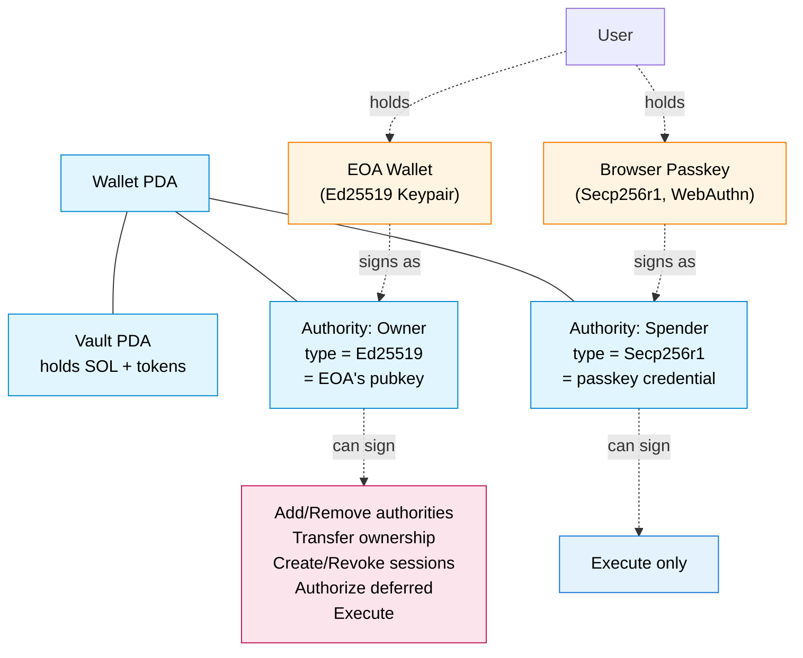
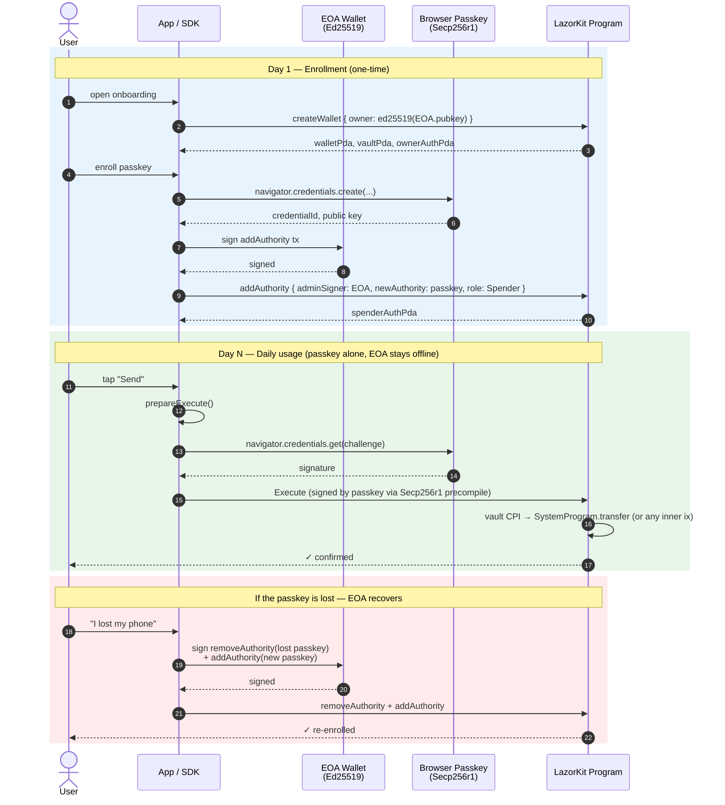

# EOA Owner + Passkey Spender

A user already has a Solana keypair (an EOA — externally owned account) and
you want to give them passkey-based "tap-to-sign" UX without taking custody
of their keys or asking them to migrate. This guide attaches a passkey as a
**Spender** authority on a LazorKit smart wallet whose **Owner** is the
existing EOA.

## Who this is for

- Wallets, exchanges, or apps onboarding existing Solana users.
- Teams that want passkey UX for routine actions (transfers, swaps) but want
  the user's hardware-secured EOA to remain the ultimate control key.
- Integrations where biometric / WebAuthn signing is the day-to-day signer
  and the EOA only comes out for sensitive operations (revoking devices,
  rotating keys).

If your users don't have an EOA, see the **Passkey-only wallet** pattern in
the [README](./README.md). If you need passkey-driven session UX or large
transactions (Jupiter, bridges), see [Choosing the right role](#choosing-the-right-role)
below — you'll want **Admin**, not Spender.

## End state



- **Owner (EOA)** can: add/remove authorities, create/revoke sessions,
  transfer ownership, execute, use deferred-execution flow.
- **Spender (passkey)** can: execute immediate transactions only.

### Lifecycle in one picture

The flow most users will experience: enroll once with the EOA, then use the
passkey for everything day-to-day. The EOA only comes back out for recovery.



## Prerequisites

```bash
npm install @lazorkit/sdk-legacy @solana/web3.js
```

You need:

- A `Connection` to a Solana RPC.
- The user's existing EOA `Keypair` (or a callback that signs with their
  wallet — anything that produces an Ed25519 signature).
- A passkey credential: its `credentialIdHash` (SHA-256 of the credential
  ID, 32 bytes), its compressed P-256 public key (33 bytes), and the
  relying-party ID (e.g. `'app.example.com'`).
- A relayer/payer keypair to fund the txs (can be the EOA itself, or a
  separate gas relayer).

## Step-by-step

The pattern below is adapted from [tests-sdk/tests/09-permissions.test.ts:47-83](../../tests-sdk/tests/09-permissions.test.ts) (EOA owner setup) and [tests-sdk/tests/07-e2e.test.ts:169-197](../../tests-sdk/tests/07-e2e.test.ts) (Spender execute). Both run as part of the SDK test suite, so the API surface here is verified against the program.

### 1. Create the wallet with the EOA as Owner

```typescript
import {
  LazorKitClient,
  ROLE_SPENDER,
  ed25519,
  secp256r1,
} from '@lazorkit/sdk-legacy';
import { Keypair, SystemProgram } from '@solana/web3.js';
import * as crypto from 'crypto';

const client = new LazorKitClient(connection);

// `userSeed` is any 32 bytes that identify this wallet. Apps typically derive
// it from the user's account ID so the same wallet is recoverable later.
const userSeed = crypto.randomBytes(32);

const { instructions, walletPda, vaultPda, authorityPda: ownerAuthPda } =
  await client.createWallet({
    payer: payer.publicKey,         // pays rent + protocol fee
    userSeed,
    owner: { type: 'ed25519', publicKey: eoaKeypair.publicKey },
  });

// `payer` signs the tx; the EOA does NOT need to sign here — its pubkey
// is just stored as the Owner authority.
await sendAndConfirmTransaction(connection, new Transaction().add(...instructions), [payer]);
```

After this tx, the user has a wallet with the EOA as sole Owner. The
SDK auto-prepends a `RegisterPayer` instruction on the relayer's first
fee-paying tx (one-time ~0.00112 SOL FeeRecord rent); subsequent txs skip
that step.

### 2. EOA adds the passkey as a Spender

The EOA must sign this transaction — it's the authorization for adding the
new authority.

```typescript
const { instructions, newAuthorityPda: spenderAuthPda } =
  await client.addAuthority({
    payer: payer.publicKey,
    walletPda,
    adminSigner: ed25519(eoaKeypair.publicKey, ownerAuthPda),
    newAuthority: {
      type: 'secp256r1',
      credentialIdHash: passkey.credentialIdHash,   // 32 bytes
      compressedPubkey: passkey.publicKeyBytes,     // 33 bytes
      rpId: passkey.rpId,                           // e.g. 'app.example.com'
    },
    role: ROLE_SPENDER,
  });

await sendAndConfirmTransaction(
  connection,
  new Transaction().add(...instructions),
  [payer, eoaKeypair],   // EOA must sign — it's the authorizing Owner
);
```

`spenderAuthPda` is the PDA that represents the passkey on this wallet. Save
it — the Spender flow uses it on every Execute. You can also recover it later
from just the `credentialIdHash` via `client.findWalletsByAuthority(...)`.

### 3. Passkey executes a transaction

This is the day-to-day flow. The passkey signs via WebAuthn and the wallet's
Vault PDA performs the actual on-chain action via CPI.

```typescript
const recipient = new PublicKey('...');

const transferIx = SystemProgram.transfer({
  fromPubkey: vaultPda,
  toPubkey: recipient,
  lamports: 1_000_000,
});

// Phase 1: SDK computes the WebAuthn challenge.
const prepared = await client.prepareExecute({
  payer: payer.publicKey,
  walletPda,
  secp256r1: {
    credentialIdHash: passkey.credentialIdHash,
    publicKeyBytes:   passkey.publicKeyBytes,
    authorityPda:     spenderAuthPda,
  },
  instructions: [transferIx],
});

// Phase 2: pass the challenge to the browser authenticator.
// In production this is `navigator.credentials.get(...)`; the test suite
// uses `fakeWebAuthnSign(passkey, prepared.challenge)`.
const response = await signWithBrowserPasskey(prepared.challenge);

// Phase 3: SDK assembles the final tx (precompile + execute).
const { instructions } = client.finalizeExecute(prepared, response);

await sendAndConfirmTransaction(
  connection,
  new Transaction().add(...instructions),
  [payer],   // payer signs the relayer tx; passkey already "signed" via WebAuthn
);
```

The passkey never needs to be online to add authorities or pay gas — it just
proves possession of the credential when the Vault PDA is about to spend.

## What the passkey CAN and CANNOT do

These boundaries are enforced on-chain (verified against the program code
cited beside each row).

| Action | Spender (passkey) | Owner (EOA) | Where it's enforced |
|---|---|---|---|
| Execute immediate transactions (transfers, CPI to any program) | ✅ | ✅ | [program/src/processor/execute/immediate.rs:100-149](../../program/src/processor/execute/immediate.rs) |
| Add another authority | ❌ | ✅ | [program/src/processor/authority/manage.rs:210-212](../../program/src/processor/authority/manage.rs) |
| Remove an authority | ❌ | ✅ (Admin/Spender only — Owner is unremovable) | [program/src/processor/authority/manage.rs:427-439](../../program/src/processor/authority/manage.rs) |
| Create / revoke sessions | ❌ | ✅ | [program/src/processor/session/create.rs:197-201](../../program/src/processor/session/create.rs) |
| Use deferred-execution flow (large txs) | ❌ | ✅ (Owner/Admin + secp256r1 only) | [program/src/processor/execute/authorize.rs:126-129](../../program/src/processor/execute/authorize.rs) |
| Transfer ownership | ❌ | ✅ (Owner only) | [program/src/processor/authority/transfer_ownership.rs:167-169](../../program/src/processor/authority/transfer_ownership.rs) |

### Choosing the right role

If the passkey needs to do anything more than execute, give it **Admin**
instead of Spender:

| Need | Required role |
|---|---|
| Transfer SOL/tokens, swap on Jupiter (under 574 B), CPI to your program | Spender |
| Create session keys for sub-second UX | Admin |
| Use deferred execution (Jupiter swaps over 574 B, bridges, multi-step) | Admin |
| Add a second device's passkey as a backup | Admin |
| Take over as Owner if the EOA is lost | (impossible — see Recovery) |

Switching role just means passing `ROLE_ADMIN` instead of `ROLE_SPENDER` in
step 2. Nothing else changes.

## Recovery & revocation

### Lost passkey (Spender)

The EOA Owner removes the lost passkey's authority:

```typescript
const { instructions } = await client.removeAuthority({
  payer: payer.publicKey,
  walletPda,
  adminSigner: ed25519(eoaKeypair.publicKey, ownerAuthPda),
  targetAuthorityPda: lostPasskeyAuthPda,
  refundDestination: payer.publicKey,
});
await sendAndConfirmTransaction(connection, new Transaction().add(...instructions), [payer, eoaKeypair]);
```

Then re-enroll a new passkey via `addAuthority` (step 2). The wallet PDA, the
vault, and all funds are untouched — only the lost authority is closed and
its rent refunded.

Reference: [tests-sdk/tests/07-e2e.test.ts:215-234](../../tests-sdk/tests/07-e2e.test.ts).

### Lost EOA Owner key

> ⚠️ **There is no Owner recovery path. If the user loses the EOA key, the
> wallet is permanently locked.** Owner authorities cannot be removed and
> ownership can only be transferred by signing with the current Owner.

Mitigations to put in place **before** the user goes live:

1. **Make the Owner a multi-sig.** Use a Squads (or similar) multi-sig
   pubkey as the Owner. Recovery becomes a matter of multi-sig governance
   rather than a single key.
2. **Pre-register a backup Owner via TransferOwnership-able key.** Store a
   second EOA key in cold storage (hardware wallet, paper backup). The user
   can call `transferOwnership` with the live EOA to move control if the
   primary is compromised, then move it back if recovered.
3. **Document the consequences.** Make it explicit in your onboarding UI
   that losing the EOA means losing the wallet — same as a hardware seed
   phrase.

For users who want passkey-based recovery, the right pattern is **Passkey
as Owner** (passkey from day one, no EOA). The EOA-as-Owner shape in this
guide deliberately concentrates the risk in the EOA so the EOA holder
remains the ultimate authority.

## Protocol fee notes

When the protocol is enabled, the relayer pays a small fee on every
fee-eligible transaction:

| Transaction | Sig fee | Protocol fee | Total |
|---|---:|---:|---:|
| `createWallet` | 5,000 lamports | 5,000 lamports | 10,000 + rent |
| `execute` (any signer) | 10,000 lamports* | 5,000 lamports | 15,000 lamports |
| `executeDeferred` | 5,000 lamports | 5,000 lamports | 10,000 lamports |

\* `execute` via secp256r1 includes a precompile signature, but it does not
add a separate fee — Solana counts only the user signature. The 10,000
includes the relayer signature plus the secp256r1 precompile session sig.

The SDK auto-prepends a `RegisterPayer` instruction on the relayer's first
fee-paying tx per program. This costs ~1,113,600 lamports (≈0.00112 SOL)
once, ever, per relayer. Subsequent txs skip this. Fee collection works even
if the relayer never registers — registration only enables stats tracking.

Full size/CU/cost numbers per instruction are in
[tests-sdk/tests/benchmark-fees.ts](../../tests-sdk/tests/benchmark-fees.ts);
run `npx tsx tests/benchmark-fees.ts` against a local validator to regenerate.

## Optional: smaller transactions with v0 + Address Lookup Tables

The SDK ships with helpers to wrap any instruction list into a v0 transaction
backed by a shared Address Lookup Table. For Secp256r1 Execute this saves
~88 bytes per tx — useful headroom when chaining multiple actions.

```typescript
import {
  buildLegacyTx,
  buildV0Tx,
  createAndExtendLut,
} from '@lazorkit/sdk-legacy';
import {
  SystemProgram,
  SYSVAR_INSTRUCTIONS_PUBKEY,
  SYSVAR_RENT_PUBKEY,
} from '@solana/web3.js';

// One-time setup: create a LUT containing addresses you reuse on most
// LazorKit txs. Pubkeys in the LUT are referenced as 1-byte indexes
// instead of 32-byte keys, so the more "shared" addresses, the bigger
// the win.
const [protocolConfigPda] = client.findProtocolConfig();
const treasuryShards = Array.from({ length: numShards }, (_, i) =>
  client.findTreasuryShard(i)[0],
);

const lut = await createAndExtendLut({
  connection,
  authority: relayerKeypair,
  addresses: [
    SystemProgram.programId,
    SYSVAR_INSTRUCTIONS_PUBKEY,
    SYSVAR_RENT_PUBKEY,
    protocolConfigPda,
    ...treasuryShards,
  ],
});

// Per-tx: build either form from the same `instructions` returned by
// any client.* method.
const { blockhash } = await connection.getLatestBlockhash('confirmed');

const legacyTx = buildLegacyTx({
  payer: payer.publicKey,
  instructions,
  blockhash,
  signers: [payer],
});

const v0Tx = buildV0Tx({
  payer: payer.publicKey,
  instructions,
  blockhash,
  signers: [payer],
  lookupTables: [lut],
});

// Send whichever you want; both produce the same on-chain outcome.
await connection.sendRawTransaction(v0Tx.serialize());
```

Storage cost for the LUT itself is small (~8 KB worst case) and refundable
when you close it. Run the benchmark to see exact size deltas — for tiny
txs (RemoveAuthority, RevokeSession) the v0 wrapper actually adds 2 bytes,
so keep using legacy for those.

## Common pitfalls

- **Owner key loss is unrecoverable.** Re-read the Recovery section
  before going to mainnet. Multi-sig the Owner if at all uncertain.
- **Spender role can't add a second device.** That's an Admin operation.
  If your UX includes "add another phone," start the passkey at Admin from
  day one.
- **Vault PDA needs SOL.** The Vault PDA holds the user's funds — it must
  be funded before any Execute that transfers SOL. The Authority PDAs only
  hold rent for themselves; they don't hold user funds.
- **Authority PDA ≠ Vault PDA.** The Vault is what spends; the Authority is
  what proves you can sign. Mixing them up usually surfaces as
  "InsufficientFunds" on what looked like a valid transfer.
- **EOA must sign management txs, not just be passed as a pubkey.** When
  you call `addAuthority` / `removeAuthority` / `transferOwnership` with
  the EOA as `adminSigner`, include the EOA `Keypair` in the
  `sendAndConfirmTransaction` signer list. The SDK builds the correct
  account metas; the runtime still requires the actual signature.
